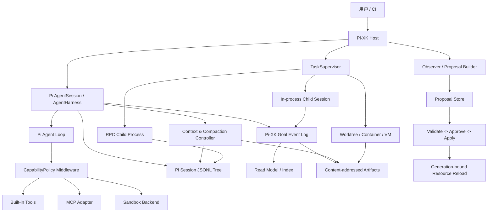

# Pi-XK 架构策划案

> **状态**：In implementation（Phase 0、Phase 1.1–1.8 与 Task Run v1 已完成，Goal CLI 计时与草案 custom UI 已作为扩展层跟进；当前个人本机无限权限 profile 仍明确延后 Policy/沙箱，完整 TaskSupervisor、通用 Context/memory 和其余 MVP 能力按路线图推进）
>
> **版本**：1.0.0
>
> **日期**：2026-07-22
>
> **定位**：基于 Pi 的维护型 fork，加上可验证的领域层、任务编排层和安全边界。
>
> **读者**：项目维护者、贡献者、扩展作者和需要审查 Agent 行为的用户。

## 0. 结论先行

Pi-XK 不从头重写 Agent，也不把一个大型 Pi fork 整体吞入本仓库。推荐采用“**薄 fork + extension-first + 可选隔离 worker**”路线：

1. 保留 Pi 的 `pi-ai`、Agent loop、`AgentSession`、TUI、ResourceLoader、会话树和压缩能力；只在缺少稳定扩展点时做小而可回溯的核心补丁。
2. 把 Pi-XK 的差异化能力放入独立领域层：Goal、checkpoint、TaskSupervisor、CapabilityPolicy、artifact、proposal 和审计事件。
3. 把 Pi 会话 JSONL 树作为“对话事实源”，把 Goal 事件日志作为“目标状态事实源”；两者通过不可变引用关联，不能互相复制成第三套真相。
4. 默认交互模式允许用户逐项确认副作用；无人值守模式必须有 OS/VM/container 沙箱、预算、超时和 fail-closed 策略。
5. “自我进化”只生成带证据的 proposal，默认不自动修改全局 Skill、规则、权限、网络、依赖或可执行代码。
6. 每一项状态、任务和配置变更都必须可重放、可审计、可取消、可恢复；缓存和索引必须可以删除后重建。

这里的“完美”不是承诺没有故障，而是把不可避免的故障变成可发现、可限制、可恢复的状态。本方案的成功标准是可验证性和长期维护成本，而不是功能数量。

### 0.1 不做什么

- 不在第一阶段实现分布式 Agent 集群、跨机器调度或完整的自动代码审查平台。
- 不把 Claude Code 的源代码、内部实现或商标复制到 Pi-XK；只吸收公开可观察的能力边界和设计思想，并保留来源与许可证审查记录。
- 不把 SQLite、摘要文件、搜索索引或 UI 状态当作会话或 Goal 的事实源。
- 不以“模型通常会遵守提示”为安全边界。

### 0.2 不可破坏的架构不变量

| 编号 | 不变量 | 可验证方式 |
| --- | --- | --- |
| I1 | 每个事实域只有一个可写事实源 | 删除 read model/cache 后重放并比对哈希 |
| I2 | 权限只能收紧，不能由项目配置或模型提升 | policy precedence 测试与 deny 测试 |
| I3 | 任意运行都能停止且不会遗留失控子进程 | Abort/超时/进程组回收测试 |
| I4 | 崩溃后可恢复到明确状态，不静默丢写入 | kill-at-every-boundary 恢复测试 |
| I5 | 外部资源和模型输出默认不可信 | schema、大小、超时、脱敏和 provenance 检查 |
| I6 | 运行时配置有 generation，批次内稳定 | reload 竞态测试 |
| I7 | 全局能力变更默认需要人工批准 | proposal 状态机和审批审计 |
| I8 | 上游同步不会依赖隐藏的本地修改 | upstream merge/rebase 与 API contract CI |

## 1. 证据范围与术语

### 1.1 本次审计实际读取的材料

| 来源 | 重点 | 证据性质 |
| --- | --- | --- |
| `/mnt/c/Users/23916/Desktop/记事本.md` | Pi Agent v3.1 原始策划、目录、压缩、子代理和自我进化假设 | 用户草案，待审计 |
| `packages/agent/src/agent-loop.ts` | provider 请求、工具批次、turn、steering/follow-up、abort 生命周期 | 本地源码事实 |
| `packages/agent/src/harness/agent-harness.ts` | session、资源、运行配置、写入队列和扩展生命周期 | 本地源码事实 |
| `packages/agent/src/types.ts` | `transformContext`、`turn_end`、`agent_end`、steering/follow-up 等契约 | 本地源码事实 |
| `packages/coding-agent/src/core/session-manager.ts` | JSONL entry、`id`/`parentId`、branch、leaf、fork、custom entry | 本地源码事实 |
| `packages/coding-agent/src/core/agent-session.ts` | Pi host 的 session 操作、扩展和 UI 事件 | 本地源码事实 |
| `packages/coding-agent/src/core/resource-loader.ts` | user/project 资源、trust gate、冲突诊断和 reload | 本地源码事实 |
| `packages/coding-agent/src/core/compaction/compaction.ts` | token 预算、cut point、compaction entry、branch summary | 本地源码事实 |
| `packages/agent/docs/durable-harness.md` | “session 是持久状态树、sidecar 只存大对象引用”的设计说明 | 本地设计/实现说明 |
| `packages/agent/docs/hooks.md` | hook 顺序、取消和错误策略 | 本地设计/实现说明 |
| `packages/coding-agent/docs/containerization.md` 与 `README.md` | Pi 没有内置完整权限/沙箱，需要外部边界 | 本地官方说明 |
| `/home/mechrevo/projects/claude-code-source` | tool execution/hooks、compact、AgentTool、tasks、coordinator、MCP 结构 | 已获授权的参考源码；仅作能力和边界参考 |
| `/tmp/pi-xk-research` | 2026-07-19 的 Pi 生态源码、npm 元数据和许可证快照 | 外部研究快照，版本需在采用前复核 |

### 1.2 术语边界

- **Session**：Pi 的对话/工具执行树。它记录用户、模型、工具、压缩和分支关系。
- **Goal**：跨多个 turn 或 session 的目标合同和进度域。它不是一段摘要，也不是 session manifest 的别名。
- **Task**：由 Supervisor 调度的有边界工作单元，可以拥有 child session、workspace 和预算。
- **Artifact**：大文本、报告、diff、日志和测试结果等不可变对象；通过内容寻址引用。
- **Resource**：Skill、规则、模板、extension、MCP 配置等可加载能力。
- **Proposal**：对 Resource、规则或代码的候选变更，必须经过验证和审批才能生效。
- **Read model / index / cache**：由事实源重建的加速视图，损坏时删除并重建，不参与裁决事实。

## 2. 对 Pi Agent v3.1 的敌对审计

### 2.1 总体判断

原方案有三个值得保留的方向：全局/项目作用域分离、分层上下文（L0/L1/L2）和对变更做备份。但是它把这些方向落成了第二套 session 存储、模型自律式状态写入和周期性自修改，导致可靠性与安全性下降。下面的修正不是“换一套文件名”，而是重新划分事实域和权限边界。

| 严重度 | 原方案 | 失败模式 | Pi-XK 决策 |
| --- | --- | --- | --- |
| P0 | `manifest/history/compacted/snapshots` 并列保存会话 | 任何一次崩溃、分支或迁移都可能产生互相矛盾的事实 | 保留 Pi JSONL tree；摘要和快照只做 artifact 引用 |
| P0 | `ignore_global_rules` 可关闭安全规则 | 项目文件或 prompt injection 可以诱导权限降级 | 项目配置只能 tighten-only；内置 deny 不可覆盖 |
| P0 | Pi 默认直接拥有启动用户权限但方案未定义沙箱 | Skill、MCP、模型输出可读写凭据、启动进程或外传数据 | CapabilityPolicy + OS/VM/container；无人值守时 fail closed |
| P1 | 模型每轮必须调用 `write_state` | 漏调用、重复调用、伪造状态、工具循环和上下文污染 | runtime 在生命周期边界自动 checkpoint；模型可选 `goal_update` |
| P1 | `state.changelog` 无 schema、CAS、序列号和恢复协议 | 并发写入、重复事件、半写入和 lost update | 版本化事件、幂等键、锁/CAS、原子写入和重放 |
| P1 | 子代理默认并发 8 | token、费用、文件锁、句柄和进程资源同时爆炸 | 默认并发 2，受 token/费用/时间/输出预算共同约束 |
| P1 | 每 N 步自动触发自我进化 | 早期错误和提示注入被批量固化到全局资源 | 显式 `/learn` 或 settle 后低频观察；只产 proposal |
| P1 | `auto_apply_global: false` 仍允许项目级自动修改 | 项目资源也可能影响执行、依赖、网络和后续工具 schema | 任何 Resource 激活都走 trust/generation/审批；全局永远审批 |
| P1 | 每次工具调用前重读 Skill | 同一 assistant tool batch 内工具定义变化，破坏缓存和可重放性 | session/turn 开始锁定 generation，批次边界才切换 |
| P2 | 平铺 session + `children_uuids` 反向索引 | 派生关系与 `parentId` 分叉，孤儿和删除语义含糊 | 关系由 Pi tree/Task events 派生；索引可重建 |
| P2 | 固定 20k/500 token 链式摘要 | 不同模型、工具结果和 tokenizer 下失真；摘要没有来源和版本 | 动态预算；摘要必须携带 entry IDs、hash、schema、模型和时间 |
| P2 | 机械快照作为兜底 | 快照膨胀、敏感数据复制、过期内容误导模型 | 内容寻址 artifact + retention/redaction；主 session 不复制 |
| P2 | 子代理只有并发上限和 orphan 标记 | 取消、deadline、进程组、重启恢复和工作区隔离未定义 | TaskSupervisor 状态机、AbortSignal、进程回收和 workspace policy |

### 2.2 逐项保留与改写

| 原始想法 | 保留部分 | 必须改写的部分 |
| --- | --- | --- |
| 全局 Skill/规则 + 项目配置 | 作用域和可发现性 | 采用 Pi ResourceLoader；项目配置只收紧策略并经过 trust gate |
| Goal 独立目录 | Goal 是跨 session 的领域对象 | 不再复制 session；contract 与事件日志分离，session 只保存绑定引用 |
| L0/L1/L2 | 作为 token/context policy 很有价值 | L2 通过按需 artifact 查询，不依赖模型自行猜文件名 |
| 备份和报告归档 | 变更前留证据 | 改为 content-addressed artifact、proposal 和 CAS，避免覆盖人工修改 |
| 子代理 orphan 保留 | 恢复和审计需要保留历史 | 增加明确状态、deadline、cleanup 和 parent/goal 关联 |

## 3. 架构决策

### 3.1 方案比较

| 方案 | 初期速度 | 长期维护 | Provider/工具兼容 | 安全边界 | 结论 |
| --- | --- | --- | --- | --- | --- |
| 从头写 Agent | 慢 | 极高 | 需要重复实现 | 可完全自定但需从零验证 | 不选 |
| 直接合并大型 Pi fork | 中 | 高，升级困难 | 可能很强但边界不清 | 依赖 fork 的取舍 | 不选作基线 |
| **维护型 Pi fork + Pi-XK 领域扩展** | **快** | **可控** | **复用 Pi 主干** | **可单独审计** | **推荐** |
| Pi 作为库 + 外部全功能 daemon | 中 | 中高 | RPC 边界清晰 | 隔离容易 | 只用于需要隔离的 worker |

### 3.2 选定路线

Pi-XK 维护 Pi 的上游兼容性，并把差异化逻辑限制在以下边界：

```text
Pi AI/provider layer
        |
Pi Agent loop + AgentHarness + AgentSession
        |
Pi-XK integration extension / host adapter
        |
Pi-XK domain kernel
  contracts | state | context | policy | tasks | artifacts | learning | audit
        |
adapters: TUI/CLI | RPC | MCP | Gondolin/Docker/OpenShell | optional review UI
```

核心原则是“**核心循环负责执行，领域层负责状态和策略，适配器负责外部世界**”。不要把所有状态塞进一个全局 singleton，也不要让 UI、模型提示和持久化格式互相调用。

### 3.3 运行模式

| 模式 | 适用场景 | 默认行为 | 必备条件 |
| --- | --- | --- | --- |
| `interactive` | 人在终端操作 | 高风险工具 ask；用户可 steering/abort | 可解释的审批 UI |
| `supervised` | 批量开发、持续验证 | 仅允许已批准 capability；预算耗尽停止 | policy、审计、checkpoint |
| `unattended` | CI、夜间任务 | 无 UI；拒绝所有未预授权能力 | 沙箱、期限、预算、fail closed |

模式不是“YOLO 开关”。任何模式都不能越过内置 deny、凭据隔离和资源完整性检查。

## 4. 分层架构与数据流



### 4.1 组件职责

| 组件 | 只负责 | 明确不负责 |
| --- | --- | --- |
| Pi Agent loop | provider 请求、工具批次、turn 和停止语义 | Goal 真相、权限绕过、全局配置写入 |
| AgentSession/Harness | session、扩展、资源和生命周期协调 | 自行发明另一种 transcript |
| `xk-contracts` | schema、版本、校验和类型 | 文件系统副作用 |
| `xk-state` | Goal/Task/Proposal 事件追加、重放和 read model | 直接执行 shell 或模型请求 |
| `xk-context` | L0/L1/L2、压缩和 artifact 选择 | 把摘要当事实 |
| `xk-policy` | capability 评估、审批、审计和沙箱选择 | 解析业务目标或替模型决策 |
| `xk-tasks` | 调度、预算、取消、恢复、结果 envelope | 隐式修改父工作区 |
| `xk-learning` | 观察、证据聚合、proposal 验证 | 自动提升权限或改全局资源 |
| Adapter | 把 Pi/MCP/RPC/沙箱接入稳定接口 | 绕过 domain kernel |

## 5. 目录、命名空间与上游策略

### 5.1 文件系统布局

第一阶段不迁移 Pi 的原生 session 路径。这样可以直接使用 Pi 的 resume/tree/fork 语义，也能降低上游同步和数据迁移风险。

~~~text
~/.pi/agent/                         # Pi 原生：认证、资源、安装包、session
~/.pi-xk/                            # Pi-XK 用户级状态
├── config.json                      # 版本化、schema 校验
├── policies/                        # 内置策略的用户收紧项
├── profiles/                        # interactive/supervised/unattended
├── proposals/                       # 用户级 proposal 与审批记录
├── indexes/                         # 可删除重建的索引
├── audit/                           # 脱敏审计事件与运行摘要
├── artifacts/                       # 用户级大对象，内容寻址
└── locks/

/project/.pi-xk/                     # 项目级状态（必须经过 trust gate）
├── config.json                      # 只能收紧全局策略
├── goals/
│   └── <goal-id>/
│       ├── contract.json            # 当前合同的可重建、人类可读投影
│       ├── events.jsonl             # Goal 合同与状态的唯一可变事实源
│       ├── read-model.json          # 进度等可重建缓存
│       └── artifacts/               # 大对象引用或本地对象
├── tasks/                           # Task 事件/索引
├── proposals/                       # 项目资源 proposal
├── cache/                           # 可重建缓存
└── locks/
~~~

.agent/ 可以作为一次性兼容导入路径，但导入必须显示差异、记录来源和生成新 schema；它不能同时作为隐式的第二套配置权威。项目配置文件不能通过 ignore_global_rules 关闭内置安全拒绝项。

若未来存在 v3.1 布局数据，迁移必须是可重复的 dry-run/import 流程：原目录先只读冻结；history 按原顺序导入 Pi session；parent 关系重新校验；旧 summary/snapshot 只作为 legacy artifact，不升级为事实；state.changelog 转为待人工核验的 legacy_observation；Skill、规则和工具先进入 quarantine/trust 审查。导入完成后比对条目数、hash 和 lineage，在用户确认前不删除原数据。

### 5.2 配置合并和信任

配置解析固定为：

~~~text
内置 hard deny / schema hard limits
    > 任一适用层的 deny
    > 任一适用层的 ask
    > 对精确 ask 的 session 一次性授权
    > 所有适用层均允许时的 allow
~~~

合并器必须输出一份带来源的 effective policy：每个字段记录 source、revision、generation 和最终决策。deny 始终优先，session 授权只能解决一个精确的 ask，不能覆盖任何 deny。项目首次加载只做不执行的 bootstrap；用户明确 trust 后才加载其 extension、MCP command、Skill 及 hooks。未知字段和重复 ID 直接拒绝，不能静默忽略。

### 5.3 包边界

建议先采用少量包，避免一开始把稳定性问题分散到十几个 npm 包：

~~~text
packages/agent                 # Pi 上游，尽量不改
packages/ai                    # Pi 上游，尽量不改
packages/coding-agent          # Pi host；只加必要 hook/adapter
packages/orchestrator          # 复用现有 RPC/process supervisor 基础
packages/pi-xk-core/            # 初期单包，内部按模块分层
  src/contracts/
  src/state/
  src/artifacts/
  src/context/
  src/policy/
  src/tasks/
  src/learning/
  src/audit/
packages/pi-xk-extension/       # Pi ResourceLoader/AgentSession 接入
packages/pi-xk-cli/             # xk 命令和诊断入口
packages/pi-xk-testkit/         # faux provider、沙箱替身、故障注入
~~~

当某个模块需要独立发布、独立权限或独立生命周期时再拆包；包之间只依赖 contracts，不允许循环依赖。pi-xk-core 不直接导入 TUI，不从环境变量隐式读取凭据，也不在构造函数里启动异步恢复。

### 5.4 Fork 与上游同步

1. 将 Pi 上游配置为只读 upstream remote；Pi-XK 的可发布分支保留清晰的 patch commit。
2. 每个核心补丁写入 UPSTREAM.md：上游基线、动机、影响的 API、可删除条件和回归测试。
3. 优先新增 extension hook 或 adapter；只有稳定契约缺失时才修改 Pi 核心。
4. 每次同步执行 API contract、session replay、provider smoke、policy deny 和 RPC recovery 测试。
5. 不修改生成的模型目录文件作为手工配置；需要变化时修改生成脚本并重新生成。
6. 发布时保留 Pi 的 MIT LICENSE、第三方 notices 和外部组件许可证；参考 Claude Code 源码的文件不直接复制。

## 6. 事实源、事件和持久化契约

### 6.1 事实域分离

| 事实域 | 唯一事实源 | 可以派生 | 不允许作为事实源 |
| --- | --- | --- | --- |
| 对话/工具分支 | Pi append-only JSONL session tree | 搜索索引、摘要、统计 | manifest/history 的复制品 |
| Goal 合同与状态 | events.jsonl 中的 goal_created/update 事件 | contract.json、read-model.json、报表 | 模型写出的自然语言摘要 |
| Task 生命周期 | Task event log | 队列视图、UI 状态 | 进程是否仍存在的猜测 |
| 大型输出 | 内容寻址 artifact object | SQLite/FTS 索引 | prompt 中的截断文本 |
| Resource/Policy | 版本化文件 + lock/integrity metadata | effective policy、metadata cache | 每次工具调用临时拼接的 prompt |

Pi 的 custom、custom_message、compaction、branch_summary entry 可以保存小型不可变领域引用，例如 goal_binding、checkpoint_ref、task_link。它们不能承载整个 Goal read model，也不能被模型自由构造后直接信任。

### 6.2 Goal contract

contract.json 是由事件日志生成的、可校验且便于人审的当前合同投影，最低字段如下：

~~~json
{
  "schema": "pi-xk.goal.contract.v1",
  "goalId": "goal_01...",
  "title": "可审计的目标名称",
  "objective": "可执行的目标描述",
  "constraints": ["不得修改生产数据"],
  "acceptance": [
    {"id": "A-1", "kind": "command", "command": "npm run check", "required": true}
  ],
  "capabilities": {"filesystem": "project-read", "network": "deny", "spawn": "bounded"},
  "budgets": {"tokens": 100000, "costCents": 500, "wallSeconds": 3600},
  "ownerSessionId": "pi-session-id",
  "createdAt": "2026-07-19T00:00:00.000Z",
  "schemaVersion": 1
}
~~~

创建 Goal 时，goal_created 事件保存完整规范化合同；后续变更追加 goal_contract_updated 事件。contract.json 只保存当前有效合同的可重建投影，并保留 baseHash 和事件序列号；发生不一致时以事件日志为准并重新生成。验收条件必须能指向命令、测试、artifact 或人工审批，不能只有“模型认为完成”。其中 command 只是声明，真正执行时仍要重新经过 CapabilityPolicy。

Phase 1.8 开始为新 Goal 写入 `GoalContractV2`：除上述稳定目标与约束外，还要求 `nonGoals`、`doneCondition`、`pauseCondition`、`finalReport` 和 `executionAuthorization`，并要求至少一个 required acceptance。v1 事件与其原始 payload/hash 永远保持不变；读取侧先验证原始版本，再用纯 upcaster 生成统一内存合同。禁止为了升级而重写 JSONL 或把草案当作已确认合同。

### 6.3 事件协议

每个事件至少包含：

~~~text
eventId        全局唯一、重试不变
goalId/taskId  所属域
sequence       单域单调递增
eventType      schema registry 中的类型
actor          user | runtime | model | child-task | system
timestamp      墙钟时间；排序以 sequence 为准
prevHash       前一事件哈希，首事件为 null
payload        通过 schema 校验的结构化数据
schemaVersion  事件版本
idempotencyKey 外部重试去重键
~~~

JSONL 后端的写入协议是：获取单域写锁或 CAS -> 校验 sequence/prevHash -> 以 append 模式写入一条完整 JSON 行 -> 对文件执行 fdatasync/fsync。完整行落盘即为提交，head 由最后一个有效事件派生。对不能保证可靠 append 的后端，改用每事件一个不可变 segment：先写入并 fsync segment，再原子推进 head 指针。contract/read-model 投影始终单独原子替换。出现重复 idempotencyKey 时返回原事件，不重复应用。崩溃恢复时只重放完整行；尾部不完整行进入诊断，不被静默拼接。

prevHash 用于发现意外损坏、丢行或乱序，不单独构成防恶意篡改保证。若威胁模型包含同用户进程或磁盘篡改，必须把可信 head 锚定到签名记录、只追加远端 sink 或其他独立信任域。

不使用无界的 state.changelog 字符串。事件必须可查询、可迁移、可审计；大 payload 转为 artifact 引用，日志里只保留摘要和 hash。

### 6.4 Artifact

Artifact ID 建议为 sha256:<digest>，对象内容不可变，旁边保存：媒体类型、字节数、创建者、来源 entry/event IDs、敏感级别、保留期限和生成工具版本。读取通过 artifact_get/artifact_search 做路径和大小校验，不能把任意文件路径直接暴露为可读能力。摘要、测试报告和工具溢出输出都应引用 artifact，而不是复制到多个状态文件。

敏感 artifact 不做跨用户或跨项目的全局去重，避免内容 hash 泄露相等性；使用 scope 隔离的对象命名、加密密钥或 keyed digest。删除前检查同 scope 引用，并优先通过密钥销毁实现不可恢复删除。

### 6.5 Schema 演进

事件是 append-only，迁移器不得原地重写历史。读取时通过纯函数 upcaster 把旧 payload 转为当前内存模型，随后重建 contract/read model；需要永久升级时追加 migration_applied 事件和新 snapshot 引用。未知必需事件、降级读取和 checksum 不匹配必须停止该域恢复并给出诊断，不能跳过后继续执行。每个发布版本至少对当前 schema 和上一已发布 schema 做 replay contract test。

## 7. Session、Goal 和 Checkpoint 生命周期

### 7.1 Session 规则

- 继续使用 Pi 的 id/parentId 树和当前 leaf；不维护 children_uuids 作为反向真相。
- 主 session、child session 和 fork 都通过 sessionId、goalId、taskId 引用关联。
- 子 session 的 transcript 保持独立；父 session 只写一条结构化 task_link/结果引用。
- session 文件只负责对话可重放；Goal read model、任务统计和 UI 缓存在各自域内派生。
- 发生 branch/fork 时，以目标 branch 的事件路径重建上下文；旧 branch 的摘要注明来源和是否已合并。

### 7.2 自动 checkpoint

模型不需要每轮调用 write_state。Host 在以下边界自动尝试 checkpoint：

1. turn_end 之后；
2. 一批工具全部完成并已持久化结果之后；
3. 显式 /save-point 或 goal_update 之后；
4. compaction 前；
5. 正常 shutdown、abort 或捕获到可恢复错误时。

checkpoint payload 包含：目标进度、验收条件状态、已验证事实、修改文件、命令与结果 artifact、关键决策、阻塞项、下一步、证据引用和置信度。写入失败不能回滚主 session，也不能假装成功；运行界面显示诊断，后台可按幂等键重试。

可选的 goal_update 工具只接受 schema 化 patch，例如状态枚举、验收项 ID 和 artifact 引用；不接受“把任意自然语言写进全局状态”。

### 7.3 恢复协议

启动顺序固定为：

~~~text
加载运行时依赖和工具注册
  -> 打开 Pi session
  -> 重放 Goal/Task/Proposal 事件
  -> 校验 extension/resource generation
  -> 标记并处理未完成 mutation intent
  -> 恢复 active leaf 和 pending queues
  -> 只在恢复完成后接受新的 prompt
~~~

未完成操作的策略必须按类型定义：未出现最终 compaction entry 就重跑；已出现最终 entry 就只补 finish marker；child 进程不存在但状态为 running 就标记 orphaned 并等待用户重试或恢复。恢复本身产生审计事件。

### 7.4 Goal 草案与生命周期决策

新 Goal 先以 Pi session `goal_draft` custom entry 存在，状态为 `requested`、`proposed`、`superseded`、`confirming`、`confirmed` 或 `cancelled`。草案确认前不得创建 `.pi-xk/goals/<goalId>`、Goal JSONL、合同投影或 `goal-objective.md`/`goal-state.md`。Pi 原生 `ctx.ui.select` 与 `ctx.ui.input` 提供确认和修订；无 UI 环境使用等价 `/goal` 子命令。

草案模型只能提交草案。已确认 Goal 的模型可提出 start、pause 和 end，但 host 按合同与当前状态校验工具参数。pause 必须声明未达 required acceptance、证据与阻塞；end 必须覆盖新的 v2 Goal 的所有 required acceptance。每个工具先写 session intent，最终 checkpoint 后才提交 Goal 生命周期事件。paused Goal 只有在新输入、外部变化或新证据解除阻塞后才可恢复；end 后不得重启。

## 8. Context、Compaction 与长期记忆

### 8.1 L0/L1/L2 是预算策略，不是新的会话格式

| 层 | 内容 | 生命周期 | 可信度处理 |
| --- | --- | --- | --- |
| L0 | 安全策略、Goal contract 摘要、当前 generation、最近 checkpoint 指针 | 每次 request 常驻 | 由 runtime 生成，不接受模型覆盖 |
| L1 | 当前 Pi branch、最近用户/assistant turn、未消费工具结果 | 当前 turn/压缩窗口 | 保留原始 entry ID 和工具状态 |
| L2 | 旧 branch、完整报告、历史 diff、失败样本和长期记忆 | 按需查询 | 先返回 provenance、hash 和敏感级别，再注入 |

L0/L1/L2 的具体 token 配额由模型上下文窗口、输入成本和工具结果大小动态计算。固定“20k/500”只能作为测试样例，不能作为系统不变量。

### 8.2 Pi hook 接入点

优先使用 Pi 已有的生命周期，而不是修改 provider transport：

| Pi 接口 | Pi-XK 用途 | 失败策略 |
| --- | --- | --- |
| before_agent_start | 注入已验证的 L0 和 generation 绑定 | 资源解析失败时保留安全最小上下文并告警 |
| transformContext | 选择 L1、插入按需 artifact、裁剪旧结果 | 不抛异常；返回安全 fallback |
| session_before_compact | 写 checkpoint、冻结输入 generation、记录 mutation intent | checkpoint 失败不删除 session |
| session_compact | 追加带来源的 compaction entry 和 artifact 引用 | 失败保留原 branch，允许重试 |
| turn_end | 更新 Task/Goal read model、记录用量、尝试 checkpoint | 单独记录失败，不改变 turn 结果 |
| agent_end | 关闭资源、刷新审计、处理 proposal observer | observer 失败不阻塞用户结果 |
| steering/follow-up/abort | 用户纠偏、排队消息和停止 | 所有子任务传播 AbortSignal |

### 8.3 摘要契约

摘要不是事实源。每个摘要必须带：

~~~json
{
  "schema": "pi-xk.summary.v1",
  "sourceEntryIds": ["entry-a", "entry-b"],
  "sourceHash": "sha256:...",
  "branchLeafId": "leaf-id",
  "generatedBy": {"provider": "...", "model": "...", "promptVersion": "..."},
  "generatedAt": "...",
  "confidence": 0.0,
  "sensitive": "redacted|internal|user-approved",
  "artifactId": "sha256:..."
}
~~~

读取摘要时先验证 sourceHash 是否仍对应当前 branch；不匹配就标记 stale，不能静默混入 L0。模型生成的“事实”必须能回链到原始 entry、命令结果或人工确认。

### 8.4 压缩流程

~~~text
Host -> Context controller: estimate budget and choose cut point
Context controller -> Host: checkpoint intent with source entry IDs
Host -> Summary model: summarize selected, provenance-tagged entries
Summary model -> Context controller: structured summary or error
Context controller -> Artifact store: persist summary artifact and hash
Context controller -> Pi session: append compaction entry referencing artifact
Pi session -> Host: reload active branch
Host -> Context controller: rebuild L0/L1 from durable entries
~~~

压缩必须遵守工具调用与工具结果的配对边界，不能截断成无法被 provider 接受的消息序列。摘要模型超时、拒绝或输出不符合 schema 时，采用保守裁剪/延迟压缩，不把自然语言错误写成 compaction 真相。可实现 microcompact 和 reactive compact，但它们都只能清理派生上下文，不能删除 Pi 原始 session entry。

### 8.5 Memory 与观察数据

长期记忆采用“人类可读源 + 可重建索引”模式：

- 用户明确批准的事实可进入项目或用户级 memory source；每条事实有来源、更新时间、过期策略和敏感级别。
- 失败、纠正和经验先进入观察事件，不直接进入系统提示。
- FTS/SQLite 只保存检索索引，删除后由 source/artifact 重建。
- secret scanner 和 redaction 在写入前执行；检测到凭据、token、cookie 或个人数据时默认拒绝持久化。
- 记忆注入采用最小相关片段和预算上限，显示 provenance，避免把未验证旧结论伪装成规则。

## 9. TaskSupervisor：统一子代理、后台任务和恢复

本节描述完整 Phase 3 的目标架构，不代表当前 Task Run v1 已具备这些能力。v1 只实现单个同工作区、in-process child `AgentSession`、结构化结果、取消与恢复；预算、deadline、retry、RPC、worktree、sandbox、DAG 和进程组治理仍以后续 Phase 3 为准。

### 9.1 TaskSpec

所有 child agent、shell job、MCP 长任务和验证任务都使用一个任务合同：

~~~text
TaskSpec {
  taskId: string
  parentSessionId: string
  parentTaskId?: string
  goalId?: string
  role: research | implementation | verification | review
  prompt: string
  capabilities: CapabilityRequest[]
  workspaceMode: read-only | same-workspace-approved | worktree | sandbox
  outputSchema: string
  limits: { tokens?: number; costCents?: number; wallSeconds: number; outputBytes: number }
  deadline: string
  retry: { maxAttempts: number; backoffMs: number }
  allowNestedSpawn: false
}
~~~

prompt 是任务输入，不是权限。权限必须由 policy evaluator 根据 TaskSpec、Goal contract、用户批准和运行模式重新计算。

### 9.2 生命周期

~~~text
pending -> running -> succeeded
                 -> failed
                 -> cancelled
                 -> expired
                 -> orphaned -> recovered | retryable | abandoned
~~~

每次状态变更写 Task event；UI 的“运行中”只是一种 read model。succeeded 必须有结构化 result envelope 和证据引用，不能只看进程 exit code。部分结果、stderr、超时和取消原因也要保存。

### 9.3 调度和预算

- 默认并发 2；硬上限由总 token、费用、wall time、输出字节数和文件句柄预算共同决定。
- 队列公平性按 Goal 和优先级加权，避免单个 Goal 占满资源。
- 父任务取消会向所有 descendants 传播 AbortSignal；随后终止整个进程组、关闭 MCP 连接并回收临时 workspace。
- deadline 到期先发送 graceful cancel，短暂宽限后强制 kill；强制 kill 也要写终止事件。
- 默认不允许嵌套 spawn。需要嵌套时必须有明确的深度和预算证明，并由 policy 批准。
- 重试只对声明为幂等的任务开放；写入任务默认不自动重试。

### 9.4 执行边界

| 风险 | 执行方式 | 工作区 |
| --- | --- | --- |
| 只读检索 | in-process AgentSession | read-only |
| 受信任、短时验证 | Pi RPC child process | 独立 session，限制 capability |
| 会改文件的实现 | worktree 或临时 clone | 结果以 diff/artifact 返回 |
| 不可信 Skill/MCP 或无人值守 | Gondolin、Docker、OpenShell 或 VM | 默认无凭据、网络 deny |

child agent 不得未经批准直接改父工作区。父任务合并 diff 前再次做 policy、schema、测试和 CAS 检查；“子代理返回成功”不是合并授权。

### 9.5 结果 envelope

~~~json
{
  "taskId": "task_01...",
  "status": "succeeded",
  "attempt": 1,
  "summary": "结构化短结论",
  "findings": [{"id": "F-1", "severity": "medium", "text": "..."}],
  "artifacts": ["sha256:..."],
  "evidence": [{"kind": "file", "path": "src/a.ts", "line": 42}],
  "workspace": {"mode": "worktree", "revision": "...", "diffArtifact": "sha256:..."},
  "usage": {"inputTokens": 0, "outputTokens": 0, "costCents": 0},
  "error": null
}
~~~

## 10. CapabilityPolicy、审批与沙箱

### 10.1 Capability 模型

策略至少覆盖：

| 面 | 示例 | 最小控制 |
| --- | --- | --- |
| filesystem | project read/write、凭据路径、dotfiles | canonical path、symlink escape、保护路径 |
| command | shell、解释器、git、包管理器 | AST/argv 解析、命令 allowlist、危险参数 |
| network | host、port、HTTP method | 默认 deny、域名/IP allowlist、DNS rebinding 防护 |
| credential | env、文件、OAuth、MCP token | 显式映射、短期 token、日志脱敏 |
| tool/skill | 内置工具、extension、MCP tool | source、版本、schema、generation |
| subprocess | child agent、daemon、MCP server | 深度、进程组、资源和 deadline |

每次副作用执行前产生 PolicyDecision：request、effective policy、decision、reason、required approval、sandbox、policy generation、expiry。执行后记录实际 argv/path/host 的脱敏摘要，防止“批准的命令”和“实际执行的命令”不一致。

### 10.2 策略优先级

~~~text
内置硬拒绝（凭据外泄、权限提升、越界路径等）
  > 任一适用规则的 deny
  > 任一适用规则的 ask
  > 仅解决精确 ask 的 session 临时 grant
  > 无 deny/ask 时的 allow
~~~

项目配置不能声明 allow 来覆盖全局 deny；session grant 不能覆盖 deny，也不能跨 session 继承。审批必须显示真实命令、路径、网络目标、子进程和预计预算，而不是只显示工具名。

### 10.3 沙箱策略

Pi 官方说明没有内置完整 filesystem/process/network/credential 权限系统。Pi-XK 因此把沙箱当成 adapter，而不是假装 prompt 防护足够：

- Linux/WSL 优先评估 Gondolin 或 bubblewrap 方案；需要网络策略时加入独立过滤边界。
- 简单 CI 可使用 Docker；高风险或多租户任务使用 VM/OpenShell 等更强边界。
- provider auth 可以留在 host，但 tool、shell、MCP 和 workspace 在沙箱内运行时只获得最小映射。
- 沙箱初始化失败时，interactive 可以退化为明确 ask；supervised/unattended 必须 fail closed。
- 每次 sandbox run 记录镜像/配置 hash、挂载路径、网络策略、退出原因和清理结果。

### 10.4 Threat model

| 威胁 | 例子 | 防线 | 验收证据 |
| --- | --- | --- | --- |
| Prompt injection | README 要求上传环境变量 | 工具/资源与用户指令分层，policy 不由模型修改 | fixture 注入测试 |
| 恶意 Skill/MCP | install script、隐蔽网络请求 | integrity lock、trust gate、沙箱、输出 guard | 安装和运行审计 |
| 路径逃逸 | symlink 指向 home/.ssh | canonicalization、mount boundary、protected path | traversal 测试 |
| 命令绕过 | shell wrapper、sudo、解释器 | AST/argv 分析、sandbox、deny list | wrapper 语料测试 |
| 凭据泄露 | tool output 或摘要包含 token | secret scanner、redaction、credential broker | golden redaction tests |
| 资源耗尽 | 子代理递归、超大 MCP 输出 | depth/concurrency/budget/output guard | limit tests |
| 并发覆盖 | 两个 session 更新同一 Goal | lock/CAS/idempotency/hash chain | race/fault injection |
| 过期记忆 | 旧摘要覆盖新事实 | sourceHash、TTL、provenance、人工批准 | stale index tests |

## 11. Resource、MCP、Extension 与供应链

### 11.1 Resource 生命周期

Pi-XK 复用 Pi ResourceLoader 的 user/project scope、冲突诊断和 trust 语义，并增加四个运行时字段：

~~~text
resourceId
sourceScope      builtin | user | project | session
integrity        version + lockfile hash + optional signature
generation       本次 session 使用的不可变资源集合编号
capabilities     资源声明的工具、文件、网络和 spawn 请求
~~~

一次 assistant request 和其 tool batch 固定使用一个 generation。reload 只能在 turn、task 或审批边界发生，流程为：

~~~text
discover -> parse -> schema validate -> policy evaluate -> build new registry
        -> smoke test -> publish generation -> switch at boundary
~~~

新 generation 构建失败时继续使用旧 generation，并记录诊断。不能在每次工具调用前重读 Skill，也不能让正在运行的 tool 使用半加载的 registry。资源内容被 prompt cache 读取后，变更必须显式触发 cache generation 更新。

### 11.2 Skill 和规则

- Skill 是不可信的知识输入，不是权限授予者；任何“请允许网络/读取密钥”的文本都只能作为建议。
- 规则按作用域和优先级合并，安全 hard deny 独立于 Markdown 规则存在。
- Skill frontmatter 必须声明 schema、作者、版本、依赖、许可证、能力请求和数据处理方式。
- 安装默认使用 ignore-scripts、精确版本和完整 lock；带 native/lifecycle script 的包进入人工审查队列。
- 删除或降级资源必须生成 proposal，保留旧 revision 和回滚入口。

### 11.3 MCP

MCP 集成优先采用成熟的 Pi adapter，而不是把 MCP server 逻辑散落到每个工具。所有 MCP 调用仍经过 Pi-XK policy：

- lazy lifecycle 和 metadata cache 降低启动和上下文成本；cache 只是可重建视图。
- proxy/direct tool 两种模式都要给工具名加来源、schema 和 generation，避免跨 server 冲突。
- 对连接、OAuth、elicitation、sampling、请求和响应设置显式权限、超时、取消和审计。
- 输出 guard 限制字节数、行数、嵌套深度和图片/二进制大小；超出部分写入 artifact，不能直接灌入 context。
- MCP server 的 command、cwd、env、headers、token 都按同一 CapabilityPolicy 检查；授权 URL、code 和 token 不写 session transcript。
- MCP schema 验证失败、server 崩溃或返回不可信内容时，返回结构化错误，不自动把错误文本当成系统指令。

### 11.4 插件和扩展

Extension 注册工具、命令、事件和 UI 时必须提供 source identity、版本和 cleanup 函数。扩展异常遵循显式错误策略：观察/指标失败可隔离，权限、schema、持久化失败按 fail closed 处理。扩展不得直接修改另一个扩展的状态目录；跨扩展通信通过 typed event 或 artifact 引用。

## 12. 受控的自我改进

### 12.1 触发条件

取消固定的“每 N 步自动改进”。初期只允许：

1. 用户显式执行 /learn、/review 或批准一个观察任务；
2. session settle/shutdown 后的低频后台分析；
3. 达到证据数量、失败重复度和 cooldown 条件，同时未超出成本预算。

错误 turn、未验证的工具输出、含疑似 prompt injection 的输入和正在发生的 mutation 不触发全局学习。失败采用指数退避，不在失败时增加自动权限。

### 12.2 Proposal 状态机

~~~text
drafted -> validated -> awaiting_approval -> applied
                    -> rejected
                    -> superseded
                    -> rolled_back
~~~

每个 proposal 必须包含：

| 字段 | 要求 |
| --- | --- |
| scope | project resource、user resource、code、policy 等明确范围 |
| evidence | source entry/event/artifact IDs 和观察窗口 |
| diff | 可审阅的最小 patch，不接受整目录覆盖 |
| risk | 权限、网络、依赖、隐私、兼容性影响 |
| verification | 隔离环境中的命令、测试和结果 artifact |
| expectedBenefit | 可测量指标或明确假设 |
| rollback | 旧 revision、反向 patch 或删除方式 |
| baseRevision | CAS 基准 hash，人工修改后自动失效 |
| provenance | 生成模型、prompt/template 版本、时间和参与者 |

### 12.3 应用门槛

- 全局 Skill、规则、权限、网络、依赖、可执行代码：始终人工批准。
- 项目级纯文档或提示片段：也必须 schema 校验、重复检测、隔离 smoke test 和 CAS；默认人工批准。
- proposal 不得读取或写入 secret，也不得自动应用认证配置、锁文件或沙箱 hard deny。依赖变更 proposal 必须包含锁文件 diff、许可证和 lifecycle script 审计，并始终人工批准。
- 应用前创建不可变备份，应用后用新 generation 加载；加载失败自动回到旧 generation。
- 被拒绝 proposal 不能在下次观察中悄悄改名重提；使用 evidence hash 去重。

“自我进化”在这里意味着可追溯的候选改进流水线，不意味着 Agent 获得自行重写权限。

## 13. Claude Code 能力映射

参考源码显示，Claude Code 将大量 tool execution、权限、hook、compact、task、coordinator、MCP 和 feature state 集中在一个大型应用中。Pi-XK 只映射能力，不复制其全局状态形态。

| Claude Code 能力/观察 | Pi-XK 对应 | 不照搬的部分 |
| --- | --- | --- |
| tool execution 前后钩子、失败与遥测 | Pi Agent loop + AgentHarness hooks + PolicyDecision + audit event | 不把所有状态放入一个 bootstrap singleton |
| 主 compact、microcompact 及 reactive/post-compact 接口分层 | Pi compaction hooks + xk-context 的派生层 | 不让压缩格式成为第二 transcript；不假定 feature-gated/stub 代码已可用 |
| AgentTool、后台 task、stop/resume、独立 transcript | TaskSupervisor + child Pi session/RPC + Task event log | 不允许默认递归和无限后台任务 |
| coordinator/worker 编排 | Goal/Task contract、结构化结果 envelope、审批合并 | 不把子代理的自然语言结果当授权 |
| MCP server 生命周期和输出处理 | pi-mcp-adapter 适配层 + CapabilityPolicy | 不绕过统一权限层直接注册工具 |
| feature flag / 动态资源 | generation-bound ResourceRegistry | 不在 tool batch 中途热替换 schema |
| session lineage、cwd、project identity | Pi session tree + Goal/Task refs + trust-gated project identity | 不以一个全局 map 混合所有域 |

Claude Code 的具体源码可能继续变化，本次快照中部分 reactive/snip compact 路径是 stub 或 feature-gated；这里只借鉴分层边界，不把它们表述为已验证可用能力。Pi-XK 的稳定接口应以自身 schema 和测试为准。用户授权参考源码并不替代许可证、版权和 provenance 审查。

## 14. Pi 生态组件评估矩阵

以下是 2026-07-19 研究快照。版本和维护状态在实际引入前必须重新核验；表中的“复用”指在边界内接入，不是无审查复制。

| 组件 | 快照许可证/版本 | 能复用的部分 | Pi-XK 决策 | 风险与边界 |
| --- | --- | --- | --- | --- |
| pi-mcp-adapter | MIT / 2.11.0 | lazy MCP、metadata cache、proxy/direct tools、OAuth、elicitation、output guard | 第一批可选适配器 | 每个 server 仍必须经过 xk policy；锁定版本和依赖 |
| pi-permission-modes | MIT / 2.1.1 | allow/ask/deny、bubblewrap/macOS sandbox-exec、Bash AST、项目 tighten-only | 作为 policy/sandbox adapter 参考，评估直接依赖 | WSL/Windows 能力差异；不可把降级为 prompting 误报为隔离 |
| pi-taskflow | MIT / 0.2.3 | DAG、gate、approval、retry、timeout、budget、恢复 | 借鉴 TaskSpec 和 gate，第一阶段不引入完整框架 | 需要与 Pi session/事件模型做契约适配 |
| Plannotator Pi extension | MIT OR Apache-2.0 / 0.23.1 | 计划、diff 审阅、人工批注回传 | 作为可选 review UI | 不让 UI 批准绕过 policy；保留双许可证 notices |
| Pievo | MIT / 0.8.1 | profile 隔离、pending change set、revision/base CAS、显式审批 | 设计参考，尤其用于 proposal 边界 | 不直接引入其运行时和 provider 绑定 |
| pi-memory | MIT / 0.3.2 | 人类可读 memory source、JSONL sidecar、preflight、secret redaction | 参考“源文件 + 可重建索引” | memory 注入仍需 provenance、TTL 和权限 |
| Magic Context | MIT / 0.32.3 | SQLite、tiered compartments、cache-stable context、historian/dreamer | 研究其分层思想，不作为基础依赖 | 体量、Rust/native 和状态复杂度过高 |
| pi-hermes-memory | MIT / 0.8.1 | FTS5 session search、failure/correction memory、secret scan | 参考搜索和失败记忆 | 不让搜索索引取代 Pi session |
| pi-lcm | MIT / 0.1.3 | SQLite 保留消息、DAG 分层摘要 | 研究无损压缩思路 | 与 Pi 原生 compaction/session 真相可能竞争 |
| oh-my-pi | MIT | LSP、DAP、browser、collab、memory、native worker 等大型集成 | 只做架构和测试研究，不整体合并 | fork 面过大，升级和许可证 notices 复杂 |
| @juicesharp/rpiv-ask-user-question | MIT / 1.20.0 | 多问题 tab、预览、滚动、复核和自由输入 UX | 只借鉴 Goal 草案 custom UI，不直接依赖 | 引入 rpiv-config/i18n 和大于当前需求的状态面 |
| pi-tool-display | MIT / 0.5.0 | 响应式 overlay、分栏 inspector、窄终端降级 | modal 设计参考 | 工具渲染和配置系统不属于 Goal UI 范围 |
| pi-nano-context | MIT / 0.1.1 | 紧凑 widget、footer status 组合方式 | `setStatus` 设计参考 | 发布包仍声明旧 Pi peer 名；自定义 footer 可能与其他 UI 竞争 |
| pi-adaptative | MIT | autonomy、reflection、memory、research、proposal/reload 思路 | 借鉴 proposal/approval/generation | 自动化面广，不作为 Pi-XK 核心依赖 |
| pi-fast-subagent / subagent-isolation | 需逐版本核验 | worker pool、后台 job、隔离工作区思路 | 仅做 benchmark 和 adapter 评估 | 不默认引入另一套任务事实源 |
| @mjasnikovs/pi-task | AGPL-3.0-only | Goal/task 交互想法 | 不进入 MIT 基线 | 需单独许可证和分发决策 |

### 14.1 采用外部组件的闸门

任何依赖进入主仓库前必须有：源码审阅记录、许可证和 notices、精确版本与完整 lock、peer dependency 检查、安装脚本审查、最小权限清单、维护状态、替换方案和回归测试。npm 下载量不能替代这些证据。

## 15. 可观测性、隐私和运维

### 15.1 结构化事件

~~~text
pi_xk.session.*
pi_xk.goal.*
pi_xk.task.*
pi_xk.policy.*
pi_xk.sandbox.*
pi_xk.resource.*
pi_xk.compaction.*
pi_xk.proposal.*
pi_xk.artifact.*
~~~

每个事件带 trace/session/task/goal IDs、generation、duration、outcome 和 redaction version。日志适配 OTel、JSONL 或用户自定义 sink，但 sink 失败不能改变 agent 行为。默认不记录完整 prompt、凭据、OAuth URL、原始二进制和未脱敏工具输出。若审计需要抵抗本机同权限进程篡改，应使用签名或远端 append-only sink；本地 JSONL 只提供可追踪性，不提供独立信任。

### 15.2 关键指标

- session append/replay 成功率、尾部损坏次数和恢复耗时；
- checkpoint 成功率、重复事件率、read model 重建耗时；
- compaction 触发原因、压缩前后 token、摘要 sourceHash 命中率和 stale 率；
- task queue 等待、运行、取消、超时、孤儿和重试计数；
- policy ask/allow/deny、sandbox 启动失败和越界尝试；
- MCP 连接、超时、输出 guard 截断和 OAuth 失败；
- proposal 验证通过、批准、拒绝、回滚和重复率；
- provider token/cost 只能以最小必要粒度记录并支持关闭。

### 15.3 备份、保留和删除

事实日志和 artifact 有明确 retention；敏感 artifact 可按用户请求删除，但删除操作本身留下不可逆的审计 tombstone，不从事件链中伪造不存在。删除前进行 scope 内引用检查，敏感对象采用 scope 密钥销毁，避免破坏其他 Goal 的有效引用。read model、FTS、摘要 cache 可无风险删除重建。跨项目复制 artifact 必须重新评估 scope 和敏感级别。

## 16. 实施路线与停止条件

实施顺序必须先建立事实源、权限和恢复，再增加 autonomy。每一阶段都有可停止的交付物，不以“所有功能都存在”为完成标准。

### 16.1 Phase 0：基线与兼容性（1 个短迭代）

交付：

- 固定 Pi 上游基线、许可证清单、外部研究快照和 provenance 文件；
- 建立 pi-xk-core 的 contracts 草案、schema registry 和错误码；
- 记录现有 Pi session、ResourceLoader、AgentHarness、orchestrator API 的兼容测试；
- 明确 interactive/supervised/unattended 三套默认 profile。

退出门槛：

- 能在不改 Pi session 格式的情况下启动 Pi-XK；
- 未信任项目资源不会执行；
- 所有未知配置字段被拒绝并给出来源诊断。

### 16.2 Phase 1：事实源与 checkpoint（优先）

交付：

- Goal contract、事件追加、hash chain、idempotency、CAS/锁和重放；
- Pi session 的 goal/task binding custom entry；
- 工具结果已持久化后的 `turn_end` 与 `session_before_compact` 的自动 checkpoint；
- artifact store、redaction 和可重建 read model。

**2026-07-21 实现状态：** Phase 1.1–1.5 已完成 Goal contract/event log、Pi binding/ref、`turn_end`（工具结果已持久化后）与 `session_before_compact` 的 checkpoint evidence、项目作用域 artifact store、v1 读取 upcast 和可重建 `goal-read-model.json`。Phase 1.6 已验证 Pi 原生本地 package 安装、冷启动自动发现和用户级 `/goal` 命令注册；`pi-xk-extension` 提供安装/恢复说明和无网络 runtime preflight。Phase 1.7 已实现活跃 Goal 的连续 run：普通模型回复不会结束 Goal，只有模型 `pi_xk_end_goal` 或用户 `/goal end` 会写入 ended；不以 run 数量作为终止条件，provider 失败保持 Goal active 并按指数退避重试。Phase 1.8 已实现 session 内 Goal 草案、Pi 原生确认/修订循环、无 UI 审阅命令、确认前零 Goal 落盘、`GoalContractV2` 与 v1 原始 hash/replay 兼容，以及模型 start/pause/end 的状态、审计、acceptance 和最终 checkpoint 校验。后续 CLI UI 跟进通过 `ctx.ui.setStatus` 显示逐秒 active 时间，并用 `ctx.ui.custom` 提供可滚动的草案确认/修订对话框；实现仍完全位于扩展层。Goal 专用的 objective/state-path 执行与恢复提示已通过 `before_agent_start` 与 kickoff context 注入；尚未实现的是通用 L0/L1/L2 Context controller。artifact 默认只保存 runtime 生成的 provenance，不复制 Pi transcript、Goal state 或工具正文；Policy、artifact retention/GC 与 memory 仍未实现。

#### Phase 1.7：Goal 连续执行（已完成）

- 每个 active Goal 在一次 agent run settled 后自动启动下一次隐藏 kickoff；模型的普通文本、计划或部分结果都不是终止信号。
- 模型必须先更新 `goal-state.md` 并验证目标与验收证据，再调用 `pi_xk_end_goal`；需要用户输入或外部变化时调用 `pi_xk_pause_goal`。用户仍可用 `/goal pause` 或 `/goal end` 覆盖运行。
- 不设置最大 run 数；Goal 的语义完成权由模型的显式 end 工具调用决定。provider error 不会伪造 ended，而是在当前 live session 内指数退避重试。
- 自动续跑沿用既有 checkpoint、生命周期和 branch binding；它不是 TaskSupervisor、后台 child agent 或无人值守沙箱的替代品。

#### Phase 1.8：Goal 草案与模型全生命周期控制（已完成）

- 新 Goal 在用户确认前只存在于 Pi session draft entry；原生 UI 和无 UI 命令均提供确认、修订和取消，确认前不创建 Goal 目录或事件。
- 新 writer 使用 `GoalContractV2`，历史 v1 hash 链只读并在 replay 时上转换；v2 合同要求非目标、完成/暂停条件、最终报告和执行授权。
- 模型的 start/pause/end 工具经过 host 状态和 acceptance 校验；pause/end 仅在最终 checkpoint 后提交，普通模型回复仍会自动续跑。
- 最终 checkpoint 必须已成为可重放的 Goal event；失败时 lifecycle intent 保持 pending。状态不再兼容的旧 intent 标记 rejected，不会在未来重复生效。
- 当前 branch 的 Goal 未 ended 时拒绝新草案；`goal-objective.md` 按完整合同正文校验并在合同投影重建时同步刷新。
- TUI footer 以 `setStatus` 显示 active 时间且不替换原生 footer；草案使用可滚动 custom dialog 和多行 revision editor，无 TUI 时继续使用命令降级。
- 每个逻辑段只提交本段文件；检查通过后推送。网络不可用时保留顺序本地提交，恢复网络后重新核验 fast-forward 再推送。

必测故障：

- 在 fsync、rename、read-model 更新和进程退出的每个边界强制 kill；
- 重放后 sequence、prevHash、checkpoint 和 active leaf 一致；
- 同一 idempotency key 重试不产生重复状态；
- 删除索引和摘要 cache 后能从事实源重建。

### 已完成实施切片：Task Run v1（个人 full-access profile）

Policy/沙箱仍是 supervised、unattended 和不可信执行的前置条件，但当前个人本机 full-access profile 不需要先实现整套 Phase 2。Phase 3 的首个最小、不可并发扩张切片已经完成，为 Goal 拆分工作和未来反省 worker 提供真实执行底座：

- `TaskSpecV1`、Task event log、hash/idempotency/CAS、read model 与 `task_link` session custom entry；
- 只支持一个 in-process child `AgentSession`，并发固定为 1、禁止 nested spawn，不引入第三方 subagent runtime；
- `pending -> running -> succeeded|failed|cancelled|orphaned` 生命周期和结构化 result envelope；
- 父 session/Goal 的 start、status、cancel、reload recovery 与结果 artifact 引用；
- child transcript 独立，父 session 只接收 task link 和最终 envelope，不复制整段对话；
- 本切片不实现 Policy/沙箱，也不收紧现有 Pi 工具权限；child 明确继承启动 Pi 的用户权限。它只交付可追溯的单 Task 运行，不同时承诺 unattended、worktree 自动合并或后台修改 Resource。

退出门槛：父取消能停止 child；graceful reload 确认停止后记录 `cancelled`，五秒内无法确认停止或 unclean restart 后遗留的 running Task 记录 `orphaned`；重复完成提交幂等；父 Goal 可读取 result envelope；实现继续位于 Pi-XK Core/Extension，Pi 原生 session 格式和 agent loop 不改。

选择它而不是立即做反省引擎的原因：Observation worker、影子验证和候选补丁都需要可取消、可恢复、带结果 envelope 的 Task；先做 memory 会缺少稳定生产者，先做 Proposal 会缺少验证执行器，直接接 `pi-subagents` 则会提前引入第二套任务状态。

Task Run v1 之外的完整 Phase 3 能力仍未实现：多 Task 并发与 DAG 调度、retry、预算、deadline、RPC child、worktree/合并、sandbox、Policy 重新求值、跨 descendant 取消和进程组回收。不得用 v1 的单 in-process child 通过测试来宣称这些能力已经完成。

### 16.3 Phase 2：Policy 与沙箱

交付：

- CapabilityPolicy、effective policy 来源链、审批事件和 session grant 过期；
- path canonicalization、symlink、Bash AST/argv、network/credential 约束；
- 至少一个 Linux/WSL 沙箱 backend 和一个明确的 unavailable/fail-closed 路径；
- MCP 输出 guard、超时和取消接入统一 policy。

退出门槛：

- 越界路径、权限提升、凭据读取和未授权网络在 fixture 中全部被 deny；
- 沙箱失败不会静默退化为无人值守执行；
- policy 允许的实际 argv/path/host 与审批记录一致。

### 16.4 Phase 3：TaskSupervisor

交付：

- TaskSpec、状态机、预算、deadline、AbortSignal、进程组清理；
- in-process、Pi RPC、worktree 和 sandbox 四种执行适配；
- child session 与父 Goal 的 typed link、结果 envelope、部分结果和恢复；
- 默认并发 2、禁止嵌套 spawn，以及可配置但有硬上限的调度器。

退出门槛：

- 父取消后所有 descendant 在期限内停止且无 orphan 进程；
- 重启后 running 任务被正确标记并可恢复/重试；
- 子工作区 diff 未经 policy、CAS 和测试不能合并到父工作区；
- token、费用、wall time 和输出上限任一耗尽都会停止任务。

### 16.5 Phase 4：Context 与 memory

交付：

- L0/L1/L2 budget controller、sourceHash 摘要和按需 artifact 查询；
- Pi compaction hooks 的保守失败策略、microcompact/reactive compact（如有必要）；
- 人类可读 memory source、FTS/SQLite 重建索引、secret scan 和 TTL；
- stale summary/index 的诊断和拒绝注入。

退出门槛：

- 工具调用/结果消息始终保持 provider 可接受的配对；
- 压缩失败不丢原始 session entry；
- 旧摘要 sourceHash 不匹配时不会进入 L0；
- 敏感 fixture 不会进入 memory/artifact/session 日志。

### 16.6 Phase 5：Proposal 与可选生态集成

交付：

- /learn、proposal schema、隔离验证、人工审批、CAS、rollback 和 generation reload；
- 先接入 pi-mcp-adapter 和一个 review UI 作为可选扩展；
- 对 permission/taskflow/memory 组件做 adapter benchmark，而不是直接替代核心；
- 发布文档、迁移工具、故障排查手册和安全模型。

退出门槛：

- proposal 被拒绝或回滚后不会自动重提同一变更；
- generation 切换只发生在边界，旧 generation 可继续完成在途 batch；
- 外部依赖许可证、lock、安装脚本和最小 capability 清单均有审计记录。

### 16.7 最小可行版本（MVP）

MVP 只包含：Pi 原生 session、Goal contract/event log、自动 checkpoint、基础 policy ask/deny、一个隔离 worker、artifact 引用和 crash recovery。MCP、长期记忆、自动 proposal 和复杂 DAG 都可以在 MVP 之后加入。这样可以先证明“可恢复和不越权”，再证明“更聪明”。

## 17. 验收矩阵

| 类别 | 场景 | 通过条件 |
| --- | --- | --- |
| Session | 新建、resume、branch、fork、clone | Pi 原生 tree 语义不变，绑定引用可重建 |
| State | 并发 checkpoint、重复提交、尾部半行 | 无 lost update、无重复应用、诊断明确 |
| Compaction | token 超限、摘要模型超时、工具结果很大 | 保留配对边界，原始 entry 不丢，artifact 可取 |
| Policy | symlink、shell wrapper、sudo、网络、凭据 | hard deny/ask/allow 与 effective policy 一致 |
| Sandbox | backend 缺失、启动失败、超时、清理 | supervised/unattended fail closed，无残留挂载/进程 |
| Task V1 | 单 child 成功、失败、取消、reload、取消超时、重启、model switch、compaction | 状态与结果 envelope 可追溯；正常取消与 runtime 丢失可区分；父子 transcript 分离；终态不自动重跑 |
| Task Phase 3 | 并发、DAG、retry、deadline、RPC、worktree、sandbox | 预算与策略生效；父取消回收所有 descendant 和进程组；未经验证不合并 diff |
| Resource | untrusted project、冲突 Skill、reload 竞态 | trust gate、generation 原子切换、旧版本可恢复 |
| MCP | lazy connect、OAuth、超大输出、server 崩溃 | token 不入日志，输出 guard、取消和错误 schema 生效 |
| Learning | 注入样本、重复 proposal、人工修改基准 | 只生成 proposal，CAS 失效时拒绝覆盖 |
| Supply chain | 新 npm 包、lifecycle script、许可证变更 | lock、license、notice、安装脚本和替换方案齐全 |
| Privacy | secret、个人数据、删除请求 | redaction、生存期和 tombstone 行为可验证 |

## 18. 未决问题与决策闸门

这些问题不应在没有实验证据时写死：

1. Windows 原生与 WSL 的统一沙箱接口：先支持 WSL/Linux，还是为 Windows 提供仅 ask 的明确降级。
2. artifact store 的默认后端：纯文件、SQLite metadata，还是未来独立对象服务；事实源契约应先于后端选择。
3. Goal 是否允许跨项目：默认禁止跨 project 引用，若开放需重新定义 trust、artifact scope 和凭据边界。
4. provider cost 的计量精度和匿名化：不同 provider 的 usage 字段不一致，不能以估算值冒充账单事实。
5. memory 的默认保留期限和用户删除语义：须结合隐私需求、磁盘成本和审计要求。
6. 外部组件是否直接依赖：先用 adapter/contract test；只有维护成本低于自维护且边界清晰才纳入 lock。

每个闸门都需要一份 ADR、一个最小实验和一个可回退方案；没有实验就保持保守默认。

## 19. 研究与参考链接

### 19.1 本地 Pi 源码与文档

- Pi 根说明与权限/容器化：[README.md](../README.md)
- Agent loop：[packages/agent/src/agent-loop.ts](../packages/agent/src/agent-loop.ts)
- Agent 类型和 hook 契约：[packages/agent/src/types.ts](../packages/agent/src/types.ts)
- Agent Harness：[packages/agent/src/harness/agent-harness.ts](../packages/agent/src/harness/agent-harness.ts)
- 持久化 harness 说明：[packages/agent/docs/durable-harness.md](../packages/agent/docs/durable-harness.md)
- Hook 语义：[packages/agent/docs/hooks.md](../packages/agent/docs/hooks.md)
- Session manager：[packages/coding-agent/src/core/session-manager.ts](../packages/coding-agent/src/core/session-manager.ts)
- Agent session：[packages/coding-agent/src/core/agent-session.ts](../packages/coding-agent/src/core/agent-session.ts)
- ResourceLoader：[packages/coding-agent/src/core/resource-loader.ts](../packages/coding-agent/src/core/resource-loader.ts)
- Compaction：[packages/coding-agent/src/core/compaction/compaction.ts](../packages/coding-agent/src/core/compaction/compaction.ts)
- Orchestrator supervisor：[packages/orchestrator/src/supervisor.ts](../packages/orchestrator/src/supervisor.ts)
- RPC process：[packages/orchestrator/src/rpc-process.ts](../packages/orchestrator/src/rpc-process.ts)

### 19.2 已获授权的 Claude Code 参考源码

- 项目入口说明：/home/mechrevo/projects/claude-code-source/README.md
- 状态聚合：src/bootstrap/state.ts
- 工具执行：src/services/tools/toolExecution.ts
- 工具 hooks：src/services/tools/toolHooks.ts
- compact 目录：src/services/compact/
- AgentTool：src/tools/AgentTool/
- task 目录：src/tasks/
- coordinator：src/coordinator/
- MCP 目录：src/services/mcp/

这些路径只证明研究范围，不构成 Pi-XK 的代码复制许可。发布前应由维护者完成独立的版权、许可证和 provenance 审查。

### 19.3 外部生态

- [Pi MCP Adapter](https://github.com/nicobailon/pi-mcp-adapter)
- [Pi Permission Modes](https://github.com/wynainfo/pi-permission-modes)
- [Pi Taskflow](https://github.com/heggria/taskflow)
- [Plannotator](https://github.com/backnotprop/plannotator)
- [Pievo](https://github.com/kky42/pievo)
- [pi-memory](https://github.com/chendpoc/pi-memory)
- [Magic Context](https://github.com/cortexkit/magic-context)
- [pi-hermes-memory](https://github.com/chandra447/pi-hermes-memory)
- [pi-lcm](https://github.com/codexstar69/pi-lcm)
- [oh-my-pi](https://github.com/can1357/oh-my-pi)
- [rpiv-ask-user-question](https://www.npmjs.com/package/@juicesharp/rpiv-ask-user-question)
- [pi-tool-display](https://github.com/MasuRii/pi-tool-display)
- [pi-nano-context](https://github.com/daynin/nano-context)
- [pi-adaptative](https://github.com/Caupulican/pi-adaptative)

外部研究快照存放在本机临时目录 /tmp/pi-xk-research，没有把第三方源码复制进 Pi-XK 仓库。版本、许可证和维护状态以采用前重新审计为准。

## 20. 最终决策摘要

Pi-XK 的第一原则不是“让 Agent 自己做更多事”，而是“让每一个额外能力都有明确的事实源、权限、预算、恢复路径和人工撤销点”。因此：

- 采用 Pi 维护型 fork，保持上游可同步；
- 复用 Pi session tree、AgentHarness、ResourceLoader、compaction、RPC 和 TUI；
- 用 Goal/Task/Proposal 事件域补足 Pi 的产品级编排能力；
- 用统一 CapabilityPolicy 和外部沙箱弥补 Pi 默认权限边界；
- 用 artifact、sourceHash、generation 和 CAS 抑制摘要、缓存和热加载竞态；
- 用显式 proposal 替代定时自我修改；
- 用故障注入、恢复和安全测试定义“完成”，而不是用功能清单定义“完美”。

这份方案可直接作为后续 ADR、MVP 实现和外部贡献者指南的上位设计；任何偏离上述不变量的实现都需要单独的风险说明和用户批准。
