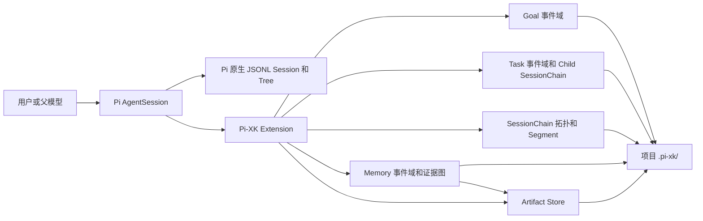

# Pi-XK 文档

Pi-XK 是 Pi 的维护型 fork 与扩展层。它在保留 Pi provider、Agent loop、原生 JSONL session、会话树和 compaction 的前提下，增加可持久化的 Goal、单 child Task、项目级 artifact、由多个物理 session Segment 组成的长期 Session Chain，以及项目级证据图 Memory。

本文档描述当前仓库已经实现的能力。未来路线、研究候选和已接受的设计决策分别保留在架构策划案、研究地图和 ADR 中，不作为当前功能承诺。

## 当前状态

| 能力 | 状态 | 当前边界 |
| --- | --- | --- |
| Goal contract 与生命周期 | 已实现 | 新 Goal 使用 V3 Intent Anchor/Current Objective；受保护修订需确认，每个 session branch 只能绑定一个未结束 Goal |
| Goal 连续执行 | 已实现 | active Goal 会自动继续，直到模型提交合格的 pause/end intent 或用户显式控制 |
| Task Run v1 | 已实现 | 同一 parent 只运行一个 in-process child；无并发、DAG、retry、deadline 或 worktree 隔离 |
| Session Chain v1.1 | 已实现 | 物理 Segment、L1 递进摘要、默认每 5 段 L2 Rollup、模型按需检索、恢复和 successor branch |
| Memory v1 | 已实现 | 项目级有向证据图、Goal/L2 稳定边界捕获、显式 verified 记忆、D0–D3 渐进检索、SQLite FTS5/图投影和恢复 |
| 日常状态与管理 | 已实现 | `/xk status` 聚合 Chain/Goal/Task/Memory/恢复诊断；Chain 支持标题、归档和默认隐藏归档项 |
| Artifact store | 已实现 | 项目级、内容寻址、单 artifact 最大 64 KiB；不是任意大文件仓库 |
| Policy 与沙箱 | 未实现 | 扩展继承启动 Pi 的用户权限，不提供逐工具授权或无人值守隔离 |
| 通用 Context controller 与跨项目知识库 | 未实现 | Memory v1 只在当前项目内工作；没有统一 token budget controller、跨项目/用户级知识合并或 vector 检索 |
| 完整 TaskSupervisor | 未实现 | 不承诺并发、DAG、预算、deadline、RPC child、worktree 合并或 descendant 回收 |
| Observation/Resource 反省闭环 | 未实现 | Memory proposal 只能修改 Memory 事实；不会自动修改 Skill、规则、依赖、权限或代码 |

`pi-xk-extension` 仍是私有 package，不发布到 npm。开发者可从可信 checkout 本地安装；固定版本通过独立 `pi-xk-v*` GitHub 二进制归档交付，归档内携带 Extension 与 Core。主要支持场景是个人本机、交互式 TUI、full-access profile。RPC、无人值守、共享多写者和不可信项目不是当前产品化承诺。

## 从哪里开始

- 第一次安装和试用：[上手指南](getting-started.md)
- 下载、校验和维护独立二进制：[GitHub-only 发行](github-release.md)
- 理解 Session、Goal、Task、Chain 的关系：[设计与边界](design-and-boundaries.md)
- 查看文件布局、恢复和故障处理：[运维与恢复](operations-and-recovery.md)
- 评估安装后对现有 Pi 的影响：[兼容性与使用影响](compatibility-and-impact.md)
- 理解 L1/L2 与模型按需读取：[Session Chain Rollup 与模型检索](session-chain-rollups-and-model-retrieval.md)
- 使用项目级长期经验：[Memory v1：证据图与渐进式检索](memory-v1.md)
- 维护 upstream fork 边界：[Host patch 边界](host-patch-boundary.md)
- 查阅完整未来路线：[Pi-XK 架构策划案](../pi-xk-architecture-proposal.md)
- 查阅已接受决策：[ADR 索引](../adr/README.md)
- 评估第三方 Pi package：[Pi 生态研究地图](../research/pi-ecosystem-forum-map.md)
- 查阅 package 级命令摘要：[pi-xk-extension README](../../packages/pi-xk-extension/README.md)

## 五分钟心智模型

这些对象互相关联，但不互相替代：

- Pi `Session` 是原生对话和工具执行树。
- `SessionChain` 是长期逻辑会话，包含一个或多个完整 Pi JSONL `Segment`。
- Pi `Compaction` 在一个物理 session 内压缩上下文；Session Chain rollover 则切换到新的物理 session。
- `Goal` 是带验收条件的持续目标，不是 session 摘要。
- `Task` 是一个有边界的 child 执行，不等于 Goal，也不等于 Segment。
- `Memory` 是跨 Goal、Task、branch 和重启的项目级证据图，不替代 Goal State、L1/L2 或 transcript。
- `Artifact` 保存带 provenance 的小型不可变结果；read model 和 catalog 都只是可重建投影。

## 必须先知道的边界

1. **没有沙箱。** Pi-XK 与 Pi 进程拥有相同的文件、进程、网络和凭据访问能力。只在受信任的代码与项目中安装。
2. **会产生额外模型调用。** Goal 草案、active Goal 连续运行、Task child、Session Chain 摘要和 Memory 稳定边界捕获都可能调用当前 provider，增加 token、费用和耗时；显式 remember/search/read 不调用模型。
3. **会写入项目目录。** 启用后，Session Chain 会在项目根创建 `.pi-xk/sessions/`；确认 Goal、启动 Task 或形成 Memory 数据后还会创建对应领域目录和投影。
4. **会改变部分交互流程。** Task 运行时普通输入进入 Pi follow-up 队列，待 Task 结束后按序处理；Goal/Chain 写命令仍会拒绝。hard rollover 失败时输入不会送给 provider；历史位置继续输入会创建 successor branch。
5. **不要手工改事件日志或锁。** `events.jsonl` 是事实源。Chain 投影用 `/chain doctor repair-projections`，Memory 投影用 `/memory doctor repair-projections`；事实完整性分别用 deep doctor 检查；遗留写锁只能按 doctor 给出的 nonce 显式修复。
6. **Pi 原生能力仍然存在。** `/resume`、`/tree`、`/compact` 和 provider/model 配置仍由 Pi 管理；`/chain` 只管理逻辑链和物理 Segment。

## 文档职责

| 文档 | 回答的问题 | 是否代表当前行为 |
| --- | --- | --- |
| 本目录 | 如何安装、使用、运维，以及会影响什么 | 是 |
| `packages/pi-xk-extension/README.md` | package 命令和本地安装速查 | 是 |
| `docs/adr/*.md` | 为什么选择当前契约和边界 | 是，针对对应已接受决策 |
| `docs/pi-xk-architecture-proposal.md` | 总体目标、未来阶段和未决闸门 | 部分；必须看状态标记 |
| `docs/research/pi-ecosystem-forum-map.md` | 第三方候选和供应链风险 | 研究快照，不是安装许可 |
| `docs/plans/*.md` | 历史实施计划与阶段证据 | 否，不是当前操作手册 |

## 版本基线

当前文档对应 2026-08-02 的 Pi-XK Goal V3、compaction recovery、Session Chain v1.1、Memory v1、增量 append checkpoint 与既有 GitHub-only 发行实现。完整验收以当前 commit 实际执行 `npm run test:pi-xk` 的输出为准，不再在长期文档中固化会随回归测试增长而过期的计数；旧的 `42/97`、`55/119`、`63/157`、`93/241` 都不是当前完整证据。发布前还必须运行 `npm run check`、`./test.sh`、Session Chain 与 Memory 评估/benchmark、隔离归档 smoke、Windows/macOS 定向 CI 和 `git diff --check`。
