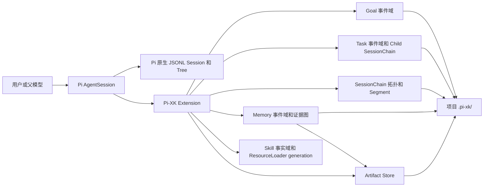

# Pi-XK 文档

Pi-XK 是 Pi 的维护型 fork 与扩展层。它在保留 Pi provider、Agent loop、原生 JSONL session、会话树和 compaction 的前提下，增加可持久化的 Goal、单 child Task、项目级 artifact、由多个物理 session Segment 组成的长期 Session Chain，以及项目级证据图 Memory 和独立 Skill 事实域。

本文档描述当前仓库已经实现的能力。未来路线、研究候选和已接受的设计决策分别保留在架构策划案、研究地图和 ADR 中，不作为当前功能承诺。

Pi-XK 的核心价值不是替换模型，而是给长期 Agent 工作增加三层可验证结构：

1. **执行层**：Goal 保存稳定意图、动态执行状态和验收证据；Task 提供单个有边界的 child 执行。
2. **上下文层**：原生 compaction 管理当前物理 session，Session Chain 用完整 JSONL Segment、L1/L2 和分支维持长期逻辑会话。
3. **知识层**：Memory 保存项目级证据和 revision，模型按 D0-D3 渐进检索；Skill 把反复验证的流程沉淀为受管资源。

模型负责语义判断和提案，Host 负责 schema、来源验证、CAS、原子发布、预算与恢复。事件和 artifact 是事实源；SQLite、Markdown、catalog、read model 和 Skill projection 都是可重建视图。

## 当前状态

| 能力 | 状态 | 当前边界 |
| --- | --- | --- |
| Goal contract 与生命周期 | 已实现 | 新 Goal 使用 V3 Intent Anchor/Current Objective；受保护修订需确认，每个 session branch 只能绑定一个未结束 Goal |
| Goal 连续执行 | 已实现 | active Goal 会自动继续，直到模型提交合格的 pause/end intent 或用户显式控制 |
| Task Run v1 | 已实现 | 同一 parent 只运行一个 in-process child；无并发、DAG、retry、deadline 或 worktree 隔离 |
| Session Chain v1.1 | 已实现 | 物理 Segment、L1 递进摘要、默认每 5 段 L2 Rollup、模型按需检索、恢复和 successor branch |
| Memory v1/v2 | 已实现 | 项目级有向证据图、Goal/L2 稳定边界捕获、带安全路由覆盖的模型主导 D0–D3 recall、run ledger、Memory review/implicit keep、增量 SQLite/History Cue 投影和恢复 |
| Skill evolution v1 | 已实现 | 项目/全局 candidate、证据化 review、项目 active projection、跨项目晋升门槛、cooldown、rollback 和 settled-boundary Skill-only reload |
| 日常状态与管理 | 已实现 | `/xk status` 聚合 Chain/Goal/Task/Memory/恢复诊断；Chain 支持标题、归档和默认隐藏归档项 |
| Artifact store | 已实现 | 项目级、内容寻址、单 artifact 最大 64 KiB；不是任意大文件仓库 |
| Policy 与沙箱 | 未实现 | 扩展继承启动 Pi 的用户权限，不提供逐工具授权或无人值守隔离 |
| 通用 Context controller 与跨项目知识库 | 未实现 | Memory v1 只在当前项目内工作；没有统一 token budget controller、跨项目/用户级知识合并或 vector 检索 |
| 完整 TaskSupervisor | 未实现 | 不承诺并发、DAG、预算、deadline、RPC child、worktree 合并或 descendant 回收 |
| Observation/Resource 反省闭环 | 部分实现 | Skill 只允许模型提交有证据的 candidate/review；不会自动修改规则、依赖、权限或代码，用户仍控制 archive/purge |

`pi-xk-extension` 仍是私有 package，不发布到 npm。开发者可从可信 checkout 本地安装；固定版本通过独立 `pi-xk-v*` GitHub 二进制归档交付，归档内携带 Extension 与 Core。主要支持场景是个人本机、交互式 TUI、full-access profile。RPC、无人值守、共享多写者和不可信项目不是当前产品化承诺。

## 从哪里开始

- 第一次安装和试用：[上手指南](getting-started.md)
- 查看整仓文档分层：[文档导航](../README.md)
- 下载、校验和维护独立二进制：[GitHub-only 发行](github-release.md)
- 理解 Session、Goal、Task、Chain 的关系：[设计与边界](design-and-boundaries.md)
- 查看文件布局、恢复和故障处理：[运维与恢复](operations-and-recovery.md)
- 评估安装后对现有 Pi 的影响：[兼容性与使用影响](compatibility-and-impact.md)
- 理解 L1/L2 与模型按需读取：[Session Chain Rollup 与模型检索](session-chain-rollups-and-model-retrieval.md)
- 使用项目级长期经验：[Memory v1/v2：证据图与渐进式检索](memory-v1.md)
- 查看模型自主回忆、路由与效果证据边界：[Ambient Recall 与 Skill 演进](ambient-recall-and-skill-evolution.md)
- 查看独立真实 provider 的受限效果结论：[Ambient Recall 效果证据（2026-08-05）](ambient-recall-effect-evidence-2026-08-05.md)
- 查看全部验证层级、对照数字和可下结论边界：[评测与证据](evaluation-and-evidence.md)
- 维护 upstream fork 边界：[Host patch 边界](host-patch-boundary.md)
- 查阅架构演进与未来闸门：[Pi-XK 架构策划案](../pi-xk-architecture-proposal.md)
- 查阅已接受决策：[ADR 索引](../adr/README.md)
- 评估第三方 Pi package：[Pi 生态研究地图](../research/pi-ecosystem-forum-map.md)
- 查阅 package 级命令摘要：[pi-xk-extension README](../../packages/pi-xk-extension/README.md)

## 五分钟心智模型

这些对象互相关联，但不互相替代：

- Pi `Session` 是原生对话和工具执行树。
- `SessionChain` 是长期逻辑会话，包含一个或多个完整 Pi JSONL `Segment`。
- Pi `Compaction` 在一个物理 session 内压缩上下文；Session Chain rollover 则切换到新的物理 session。
- `Goal` 是带验收条件的持续目标，不是 session 摘要。
- `Task` 是一个有边界的 child 执行，不等于 Goal，也不等于 Segment。
- `Memory` 是跨 Goal、Task、branch 和重启的项目级证据图，不替代 Goal State、L1/L2 或 transcript。
- `Skill` 是独立的有证据资源事实域；candidate/revision/projection 不取代 Memory，也不能改变 Goal 合同、system prompt 优先级或工具权限。
- `Artifact` 保存带 provenance 的小型不可变结果；read model 和 catalog 都只是可重建投影。

## 模型自动做什么

| 能力 | 默认自动行为 | 用户保留的控制 |
| --- | --- | --- |
| Goal | active 后按未完成验收继续；仅 Current Objective 可在证据支持下自动细化 | review/confirm/revise/pause/start/end；受保护合同变化必须确认 |
| Task | 模型或用户可启动一个 child；结果结构化回传，父输入按序排队 | status/cancel；不会自动并发或创建 worktree |
| Session Chain | soft/hard 阈值 rollover；默认每 5 个 sealed Segment 后台生成 L2 | rename/archive/continue/rollover/rollup config/doctor |
| Memory | 模型自行判断是否 D1，按需进入 D2/D3；成功 settled 后可 keep/revise/supersede/dispute/create | remember/search/show/timeline/archive/invalidate/purge/config/doctor |
| Skill | 模型可从成功且可复用的工作提议 candidate/revision，Host 验证后发布并在 settled boundary 热刷新 | candidate 审查、rollback/archive/purge/config/doctor |

用户通常不需要手工驱动 Memory 检索或 Skill 更新，但“自动”不表示每轮强制搜索、自动删除历史或绕过证据。模型不能 archive、invalidate、purge、修改 Goal 受保护字段或覆盖非 Pi-XK 管理的 Skill。

## 已验证结论

- 2026-08-06 的五个受控 Aider Polyglot 任务中，Native Pi 与 Pi-XK 都是 `5/5`。这证明短任务完成率没有因 Pi-XK 工作流退化，不能证明 Pi-XK 的短任务结果质量领先。
- 同一轮中，Pi-XK 专属工作流 `15/15` 通过，其中包含 8 个确定性场景和 7 个真实 DeepSeek 断言，覆盖 Goal、Task、Chain、compaction、Memory、Skill、doctor 和本地安装。
- 2026-08-05 的密封三臂 Ambient Recall 评测中，treatment 主动 D1 为 `16/18`、相关 D2 为 `12/18`，外部 verifier 为 `12` 对 placebo 的 `2`，stale/冲突盲从为 `0`，无关任务 D1 为 `0/3`。
- 公共短任务中 Pi-XK 总输入 token 高 `34.5%`、成本高 `23.1%`、总耗时低 `4.5%`；样本量和语言方差不足以把耗时差异解释为稳定性能优势。

完整环境、任务、费用、限制和复现命令见[评测与证据](evaluation-and-evidence.md)。当前证据支持“长期状态工作流可运行、可恢复，且 Ambient Recall 在固定密封任务中有净收益”，不支持“Pi-XK 普遍优于其他 Agent”或“所有任务都更省 token”。

## 必须先知道的边界

1. **没有沙箱。** Pi-XK 与 Pi 进程拥有相同的文件、进程、网络和凭据访问能力。只在受信任的代码与项目中安装。
2. **会产生额外模型调用。** Goal 草案、active Goal 连续运行、Task child、Session Chain 摘要、Memory 稳定边界捕获和 Skill candidate/review 都可能调用当前 provider，增加 token、费用和耗时；显式 remember/search/read、Skill candidate/read、refresh 和 doctor 不调用模型。
3. **会写入项目目录。** 启用后，Session Chain 会在项目根创建 `.pi-xk/sessions/`；确认 Goal、启动 Task 或形成 Memory 数据后还会创建对应领域目录和投影。
4. **会改变部分交互流程。** Task 运行时普通输入进入 Pi follow-up 队列，待 Task 结束后按序处理；Goal/Chain 写命令仍会拒绝。hard rollover 失败时输入不会送给 provider；历史位置继续输入会创建 successor branch。
5. **不要手工改事件日志或锁。** `events.jsonl` 是事实源。Chain 投影用 `/chain doctor repair-projections`，Memory 投影用 `/memory doctor repair-projections`；事实完整性分别用 deep doctor 检查；遗留写锁只能按 doctor 给出的 nonce 显式修复。
6. **Pi 原生能力仍然存在。** `/resume`、`/tree`、`/compact` 和 provider/model 配置仍由 Pi 管理；`/chain` 只管理逻辑链和物理 Segment。

## 文档职责

| 文档 | 回答的问题 | 是否代表当前行为 |
| --- | --- | --- |
| 本目录 | 如何安装、使用、运维，以及会影响什么 | 是 |
| `packages/pi-xk-extension/README.md` | package 命令和本地安装速查 | 是 |
| `docs/adr/*.md` | 为什么选择当前契约和边界 | 是，针对对应已接受决策 |
| `evaluation/capabilities/` | 如何复现协议、公共对照和真实工作流证据 | 日期化证据，不是长期 SLA |
| `docs/pi-xk-architecture-proposal.md` | 总体目标、未来阶段和未决闸门 | 部分；必须看状态标记 |
| `docs/research/pi-ecosystem-forum-map.md` | 第三方候选和供应链风险 | 研究快照，不是安装许可 |
| `docs/plans/*.md` | 历史实施计划与阶段证据 | 否，不是当前操作手册 |

## 版本基线

当前文档覆盖截至 2026-08-07 已合入 `main` 的 Goal V3、compaction recovery、Session Chain v1.1、Memory v1/v2、Ambient Recall 安全路由、Skill evolution v1、增量 append/checkpoint/projection、能力评测与既有 GitHub-only 发行实现。完整验收以当前 commit 实际执行 `npm run test:pi-xk` 的输出为准，不在长期文档中固化会随回归测试增长而过期的测试计数。发布前还必须运行 `npm run check`、`./test.sh`、语义评估、性能基准、隔离归档 smoke、Windows/macOS 定向 CI 和 `git diff --check`。CI 中的 Ambient effect fixture 只验证评测协议；真实效果结论必须引用独立 provider report。
