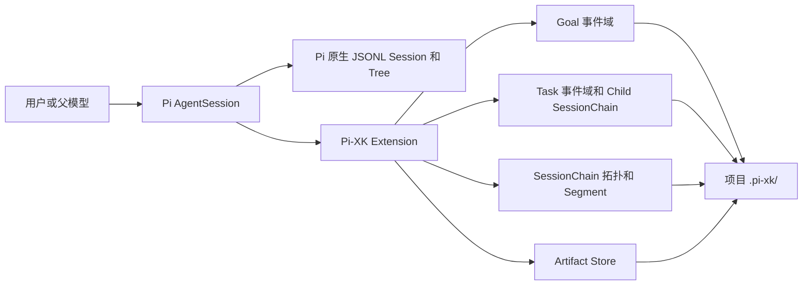

# Pi-XK 文档

Pi-XK 是 Pi 的维护型 fork 与扩展层。它在保留 Pi provider、Agent loop、原生 JSONL session、会话树和 compaction 的前提下，增加可持久化的 Goal、单 child Task、项目级 artifact，以及由多个物理 session Segment 组成的长期 Session Chain。

本文档描述当前仓库已经实现的能力。未来路线、研究候选和已接受的设计决策分别保留在架构策划案、研究地图和 ADR 中，不作为当前功能承诺。

## 当前状态

| 能力 | 状态 | 当前边界 |
| --- | --- | --- |
| Goal contract 与生命周期 | 已实现 | 每个 session branch 只能绑定一个未结束 Goal；确认前不创建 Goal 文件 |
| Goal 连续执行 | 已实现 | active Goal 会自动继续，直到模型提交合格的 pause/end intent 或用户显式控制 |
| Task Run v1 | 已实现 | 同一 parent 只运行一个 in-process child；无并发、DAG、retry、deadline 或 worktree 隔离 |
| Session Chain v1.1 | 已实现 | 物理 Segment、L1 递进摘要、默认每 5 段 L2 Rollup、模型按需检索、恢复和 successor branch |
| Artifact store | 已实现 | 项目级、内容寻址、单 artifact 最大 64 KiB；不是任意大文件仓库 |
| Policy 与沙箱 | 未实现 | 扩展继承启动 Pi 的用户权限，不提供逐工具授权或无人值守隔离 |
| 通用 Context controller 与长期记忆 | 未实现 | 已有 Chain 专用 L1/L2 检索，但没有跨域/跨项目 memory 或通用 token policy controller |
| 完整 TaskSupervisor | 未实现 | 不承诺并发、DAG、预算、deadline、RPC child、worktree 合并或 descendant 回收 |
| Proposal/反省闭环 | 未实现 | 不自动修改 Skill、规则、依赖、权限或代码 |

`pi-xk-extension` 当前是仓库内的私有本地 package，不是稳定公开发行包。主要支持场景是个人本机、交互式 TUI、full-access profile。RPC、无人值守、共享多写者和不可信项目不是当前产品化承诺。

## 从哪里开始

- 第一次安装和试用：[上手指南](getting-started.md)
- 理解 Session、Goal、Task、Chain 的关系：[设计与边界](design-and-boundaries.md)
- 查看文件布局、恢复和故障处理：[运维与恢复](operations-and-recovery.md)
- 评估安装后对现有 Pi 的影响：[兼容性与使用影响](compatibility-and-impact.md)
- 理解 L1/L2 与模型按需读取：[Session Chain Rollup 与模型检索](session-chain-rollups-and-model-retrieval.md)
- 维护 upstream fork 边界：[Host patch 边界](host-patch-boundary.md)
- 查阅完整未来路线：[Pi-XK 架构策划案](../pi-xk-architecture-proposal.md)
- 查阅已接受决策：[ADR 索引](../adr/README.md)
- 评估第三方 Pi package：[Pi 生态研究地图](../research/pi-ecosystem-forum-map.md)
- 查阅 package 级命令摘要：[pi-xk-extension README](../../packages/pi-xk-extension/README.md)

## 五分钟心智模型

这些对象互相关联，但不互相替代：

- Pi `Session` 是原生对话和工具执行树。
- `SessionChain` 是长期逻辑会话，包含一个或多个完整 Pi JSONL `Segment`。
- Pi `Compaction` 在一个物理 session 内压缩上下文；Session Chain rollover 则切换到新的物理 session。
- `Goal` 是带验收条件的持续目标，不是 session 摘要。
- `Task` 是一个有边界的 child 执行，不等于 Goal，也不等于 Segment。
- `Artifact` 保存带 provenance 的小型不可变结果；read model 和 catalog 都只是可重建投影。

## 必须先知道的边界

1. **没有沙箱。** Pi-XK 与 Pi 进程拥有相同的文件、进程、网络和凭据访问能力。只在受信任的代码与项目中安装。
2. **会产生额外模型调用。** Goal 草案、active Goal 连续运行、Task child 和 Session Chain 摘要都可能调用当前 provider，增加 token、费用和耗时。
3. **会写入项目目录。** 启用后，Session Chain 会在项目根创建 `.pi-xk/sessions/`；确认 Goal 或启动 Task 后还会创建对应领域数据。
4. **会改变部分交互流程。** Task 运行时普通输入被拦截；hard rollover 失败时输入不会送给 provider；历史位置继续输入会创建 successor branch。
5. **不要手工改事件日志。** `events.jsonl` 是事实源。投影通过 Core rebuild API 恢复；prepared rollover 与 sealed integrity 通过 `/chain doctor` 处理。
6. **Pi 原生能力仍然存在。** `/resume`、`/tree`、`/compact` 和 provider/model 配置仍由 Pi 管理；`/chain` 只管理逻辑链和物理 Segment。

## 文档职责

| 文档 | 回答的问题 | 是否代表当前行为 |
| --- | --- | --- |
| 本目录 | 如何安装、使用、运维，以及会影响什么 | 是 |
| `packages/pi-xk-extension/README.md` | package 命令和本地安装速查 | 是 |
| `docs/adr/*.md` | 为什么选择当前契约和边界 | 是，针对对应已接受决策 |
| `docs/pi-xk-architecture-proposal.md` | 总体目标、未来阶段和未决闸门 | 部分；必须看状态标记 |
| `docs/research/pi-ecosystem-forum-map.md` | 第三方候选和供应链风险 | 研究快照，不是安装许可 |
| `docs/plans/*.md` | 历史实施计划与阶段证据 | 否，不是当前操作手册 |

## 版本基线

当前文档对应 Session Chain v1.1 / Rollup v1 实现。2026-07-24 本工作区的修正后入口 `npm run test:pi-xk` 已通过 Core 55/55、Pi/Host 集成 119/119；旧的 Core 42 / Pi 集成 97 不再是完整验收证据。发布前还必须运行 `npm run check`、`git diff --check` 和完整 Session Chain benchmark。
