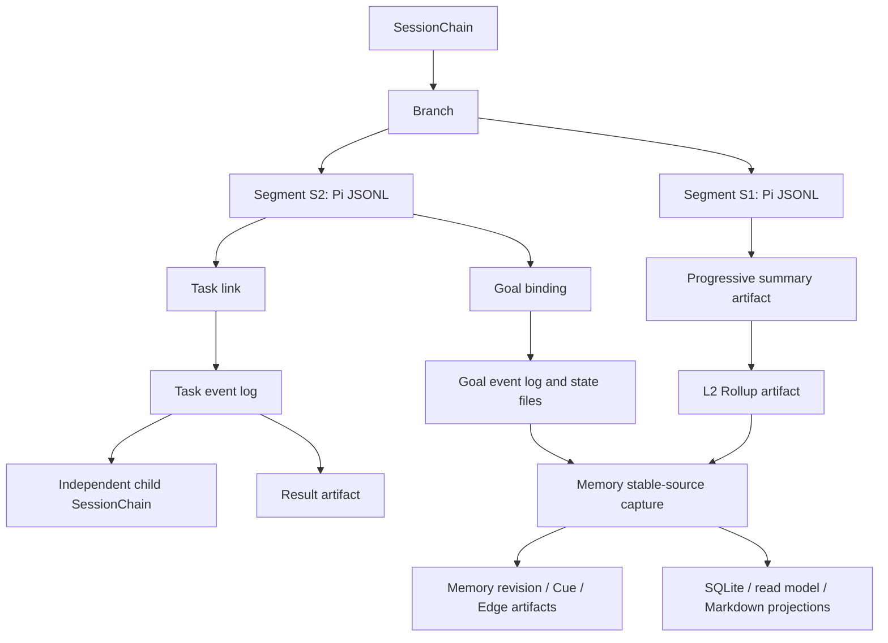

# Pi-XK 设计与边界

本文把当前实现的领域对象、事实源、集成边界和明确非目标集中说明。它不是未来功能清单；未来路线见[架构策划案](../pi-xk-architecture-proposal.md)，具体决策理由见 [ADR 索引](../adr/README.md)。

## 1. 设计目标

Pi-XK 解决的是长期 Agent 工作中的可验证状态问题：目标如何持续、child 工作如何追踪、物理 session 过大时如何安全切换、崩溃后如何知道真实状态。

它不重新实现 Pi 的核心运行时。当前原则是：

1. Pi 继续拥有 provider、Agent loop、tool transcript、原生 session tree、model 配置、TUI 和 compaction。
2. Pi-XK 只为 Goal、Task、Session Chain、Memory 和 Artifact 建立独立领域事实源。
3. 领域间通过不可变 ID、event reference 和 artifact reference 连接，不复制另一事实域的完整正文。
4. 所有 read model、catalog 和 cache 都可从事实源重建，不能参与最终裁决。
5. 运行时失败应留下可诊断状态，不通过静默重写历史来伪装成功。

## 2. 对象边界

| 对象 | 所有者 | 作用 | 不是什么 |
| --- | --- | --- | --- |
| Pi Session | Pi | 保存用户、模型、工具、树分支和 compaction entry | 不是 Goal 状态机 |
| Session Segment | Pi + Pi-XK 拓扑 | 一个完整、可单独由 Pi 打开的 JSONL session | 不是任意截断的消息块 |
| SessionChain | Pi-XK | 把多个 Segment 组织成长期逻辑会话与 branch | 不是 Pi session tree 的替代品 |
| L1 Segment Summary | Pi-XK Artifact Store | 保存单个 sealed Segment 的增量与 carry-forward | 不是 transcript 或系统指令 |
| L2 Chain Rollup | Pi-XK Artifact Store | 汇总一个 branch 固定窗口内的有序 L1 evidence | 不是通用长期 memory |
| Project Memory | Pi-XK Memory event log + Artifact Store | 保存跨 Goal、Task、branch 和重启的项目级证据图 | 不是 Goal State、摘要、第二 transcript 或跨项目知识库 |
| Memory Cue/Edge | Pi-XK Memory event log + Artifact Store | 提供规范化关键词和有向、多关系关联 | 标题和热度都不能单独升级为可信事实 |
| Compaction | Pi | 在同一个物理 session 内压缩送给 provider 的上下文，并为下一次真实 run 提供一次性恢复上下文 | 不是 rollover、新用户请求或独立续跑器 |
| Goal | Pi-XK | 保存稳定 Intent Anchor、可受控演进的 Current Objective、约束、验收、生命周期和执行状态 | 不是 prompt、摘要或 Task 列表 |
| Task | Pi-XK | 执行一个有边界的 child 工作并返回结构化结果 | 不是并发调度框架或 Goal 的物理分段 |
| Artifact | Pi-XK | 保存内容寻址、带 provenance 的不可变小型结果 | 不是 transcript、Memory 事件域或通用 blob store |
| Read model/catalog | Pi-XK | 以 event offset、sequence 和 head hash 加速状态和拓扑查询 | 不是事实源，删除后应可重建 |

### 2.1 关系



一个 Task 可以从普通 session 或 active Goal 中启动。Task V2 记录 parent 的 `chainId/branchId/segmentId/entryId`，并创建独立 child chain。它不会把 child transcript 复制回 parent；parent 只得到小型 link 和最终 result envelope。

## 3. 事实源与投影

| 领域 | 权威事实源 | 可变业务文件 | 可重建投影 |
| --- | --- | --- | --- |
| Pi 对话 | Pi 原生 JSONL session | 无 Pi-XK 替代文件 | Pi 自身运行视图 |
| Goal | `.pi-xk/goals/<goalId>/events.jsonl` | `goal-state.md` | `contract.json`、`goal-objective.md`、`goal-read-model.json` |
| Task | `.pi-xk/tasks/<taskId>/events.jsonl` | 无 | `task-read-model.json` |
| Session Chain | `.pi-xk/sessions/chains/<chainId>/events.jsonl` + Segment JSONL + L1/L2 artifacts | 当前 writable head Segment | `chain-read-model.json`、catalog、Rollup Markdown、pending/runtime state |
| Memory | `.pi-xk/memory/events.jsonl` + Memory/Cue/Edge/proposal/source artifacts | `memory-config.json` 只控制 enabled/off | `memory-read-model*.json`、`index.sqlite`、History Cue、source cursor、Markdown |
| Artifact | `.pi-xk/artifacts/objects/...` 的内容寻址对象 | 无 | manifest/index 类视图 |

Goal event log 裁决合同 revision 与 lifecycle；`goal-objective.md` 是只读合同投影；`goal-state.md` 是模型执行进度的可变权威文件。Objective 保存 Intent Anchor、Current Objective 和受保护合同字段，State 保存证据、完成/未决项、失败路径、阻塞和下一动作。模型必须在完成或暂停前更新 state，再由 runtime 把 lifecycle intent 与 checkpoint evidence 关联。

## 4. Pi 集成边界

Pi-XK 主要通过 Extension API 集成，并只为 Session Chain 增加了小型 host 能力：

- `summarizeSessionContext`：生成带来源范围和 usage provenance 的 rollover 摘要；
- `rolloverSession`：在同一 runtime 中安全替换物理 session；
- `session_before_rollover` 与 `reason: "rollover"`：让扩展区分物理轮转和普通 session 切换。
- `queueUserMessage`：把 extension-origin 用户消息加入 Pi 原生 follow-up 队列，但不立即启动 agent turn。

明确保持不变的 Pi 能力：

- provider 与 model registry；
- Agent loop 和工具调用协议；
- 原生 session entry schema；
- session tree 的 `id/parentId` 语义；
- `/resume`、`/tree`、`/fork`、`/clone` 和 `/compact` 的基本职责；
- compaction 的摘要、短标题与恢复状态，以及独立的 branch summary；
- ResourceLoader、TUI footer 组合和 extension trust 机制。

Session Chain marker 使用 Pi 支持的 custom entry/custom message，不向原生 entry schema 增加私有字段。Segment 可单独由 Pi 打开；逻辑拓扑由 Pi-XK sidecar 事件维护。

## 5. Goal 设计边界

### 已实现

- 草案生成、审阅、修订、确认和取消；
- 确认前零 Goal 领域文件落盘；
- 新 Goal 写入 `GoalContractV3`，分别保存不可自动改变的 `intentAnchor`、可受控修正的 `objective` 和单调 revision；
- objective-only 自动修订、受保护字段用户确认、expected revision/head CAS 和 Goal event v2；
- V3 Objective/State 分工、State revision 诊断、`acceptance_matrix` 和最多 20 条重要工作日志；
- V1/V2 合同与事件保持原始 hash 可读，首次 V3 迁移不静默推断 Anchor；
- active、paused、ended 生命周期及事件 hash/CAS/idempotency；
- active Goal 连续 run、provider 失败指数退避；
- checkpoint evidence 后提交模型 start/pause/end intent；
- quit、reload、session 切换、abort、tree navigation 和 crash recovery 的保守暂停；
- compaction 不暂停，Session Chain rollover 不暂停；
- TUI 状态计时和无 TUI 命令降级。

### 明确限制

- 一个 session branch 只能有一个 active 或 paused Goal；
- 同一 branch 最多一个待确认 Goal revision，pending revision 会阻止 rollover 和其他 Goal 状态变更；
- ended Goal 不会自动重开；
- reopen 后必须由用户 `/goal start` 或满足恢复证据的模型 tool 显式恢复；
- 用户 `/goal end` 是终止覆盖，不等同于验收通过；
- Goal 文件不跨项目自动迁移；
- 没有独立的 token/cost/wall-time 强制预算执行器。

模型不能直接编辑 `goal-objective.md`。只有 Current Objective 且仅该字段变化时可自动应用；Intent Anchor、验收、约束、授权、交付和停止条件变化必须进入可见确认。

## 6. Task Run v1 设计边界

### 已实现

- `pending -> running -> succeeded|failed|cancelled|orphaned`；
- 一个 in-process child `AgentSession`；
- research、implementation、verification、review 四种 role；
- child-only `pi_xk_finish_task` 结构化终态；
- 独立 child transcript/SessionChain 与 parent result envelope；
- parent Goal barrier、取消、reload/startup recovery 和 terminal backfill；
- Task V1 只读兼容与 Task V2 chain reference。
- Task 运行期间的普通用户输入按序进入 Pi follow-up 队列，终态交付后才由 parent 处理；status/cancel 保持即时。

### 明确限制

- 并发固定为 1；
- `workspaceMode` 当前是 `same-workspace`；
- 不加载 extension 和 theme，不允许 nested spawn；
- 没有 worktree、merge、sandbox、RPC child、DAG、retry、deadline 或预算硬限制；
- Goal/Chain 写命令与第二个 Task 在 child 运行期间仍被阻止；消息排队不等于父子并发；
- child 与 parent 共享进程权限和工作目录，因此不能被视为安全隔离；
- graceful shutdown 最多等待五秒；无法确认停止时记录 `orphaned` 并 detach，不声称进程已被可靠回收。

## 7. Session Chain v1.1 设计边界

### Segment 契约

每个 managed Segment 是完整 Pi JSONL：

1. 顶部包含 chain link 和前一段 cumulative summary 的 summary-in；
2. 中间是 Pi 原生会话正文；
3. 封存时写入本段 delta 与累积 carry-forward 的 summary-out；
4. 事件记录 source leaf、文件 hash、summary artifact 和 successor identity；
5. sealed 后不再重写。

当前 writer 使用 `pi-xk.segment-summary.v2`，在完整 V1 provenance 上增加经过安全校验的单行标题。历史 V1 artifact 保持可读并返回 `title: null`；标题用于列表定位和显式读取，不进入 manifest 正文。

已有正文的 Pi session 作为 external root 被采用一次，不复制到 `.pi-xk`。其 successor 才是 Pi-XK managed Segment。

rollover 前会重新读取前序 L1 artifact，并验证当前 `summary-in` 的 artifact ID、carry-forward 正文/hash、chain、branch、source/target Segment provenance。任一不一致会中止 rollover，不自动修复被篡改事实。

新 L1 写入 Artifact Store 后会立即按 artifact ID read-back。marker、source seal、successor `summary-in` 和相关 hash 只使用 read-back 的 canonical 内容；若 Artifact Store 的脱敏或序列化使 schema/provenance 不再成立，rollover 在 branch head 改变前失败。

### Rollover 协议

rollover 使用两阶段状态：

```text
rollover_prepared
  -> summary-out 和 target JSONL durable
  -> rollover_committed

失败路径：
rollover_prepared -> rollover_aborted
```

startup 或 `/chain doctor` 会检查 prepared marker：目标完整时 commit，目标可确定性重建时 rebuild-and-commit，否则 abort 回 writable source。不会通过修改 sealed source 来“修复”拓扑。

### 阈值与 gate

| 阈值 | 条件 | 行为 |
| --- | --- | --- |
| soft | 16 MiB 或 4,000 entries | agent settled 后、gate 清空时自动 rollover |
| hard | 64 MiB 或 16,000 entries | 下一条普通输入送给 provider 前必须先 rollover |

以下状态阻止 rollover：

- Task 正在运行；
- Task 结果尚未交付 parent；
- Goal 草案待处理；
- Goal revision 待用户确认；
- Goal lifecycle intent 尚未 settled。

阈值当前是代码常量，没有公开配置项。不要在文档或部署脚本中假设可通过 settings/env 调整。

### L2 Rollup 与模型发现

默认每个 branch 每 5 个 sealed Segment 生成一个 L2 Rollup。窗口连续、不重叠，successor branch 从自己的 `S1/W1` 开始。L2 输入只使用窗口内有序、校验通过的 L1 artifacts，不扫描 transcript。

L2 artifact 是结构化事实源；Markdown 是可重建投影。rollover commit 只登记 branch 串行的后台 publication job，不等待 provider。跨进程 generation lock 保证同一 branch/window 最多一个生成者；已有 artifact 时只重试 event 或 Markdown，不再次付费生成。发布使用 `rollup_published` v2 event，失败按 provider、I/O、provenance、schema、digest、event conflict 或 projection 分类记录 `rollup_failed` v2 event。

每次模型请求只追加固定大小的 metadata manifest。模型通过 `pi_xk_list_chain_summaries` 和 `pi_xk_read_chain_summary` 按需读取当前 chain/read-model 关联 branch 的证据，不能借 artifact ID 任意读取 Artifact Store。列表区分 `unchecked`、`verified`、`invalid`；读取正文前必须经过统一 L1/L2 provenance 验证。摘要正文和其中的伪系统指令不会进入系统提示词。

manifest 只说明列表能提供 L1 标题和范围，不注入模型生成标题。compaction recovery 在下一次真实 run 的 system prompt 中提醒模型先列标题/范围再按需读取 verified 摘要，但不会创建 user/custom message、重发最后一条用户消息或触发第二个 Goal kickoff。

常规 manifest、status、picker 和分页摘要查询走 checkpointed read-model/catalog 快速路径，只读取新增 event tail 或当前页。event 文件缩短、offset 异常或 head 不匹配时退回完整 replay。`/chain doctor deep` 始终从事实源完整验证；全 Artifact Store orphan 扫描不在普通请求路径。

Chain 的确定性首条用户输入标题、`/chain rename`、archive 与 `/chain list all` 属于发现层。archive 通过 v3 event 持久化，只从默认 picker/list 隐藏，不删除 chain、Segment 或 artifact。

完整契约见[Session Chain Rollup 与模型检索](session-chain-rollups-and-model-retrieval.md)。

## 8. Memory v1 设计边界

Memory v1 是当前项目内的长期证据层。它使用有类型、有方向、带时间与 provenance 的多重图，并把以下三维状态分开处理：

- trust：`verified`、`model_inferred`、`disputed`；
- freshness：`current`、`stale`、`unknown`，根据来源和相关 Git path 动态计算；
- lifecycle：`active`、`superseded`、`invalidated`、`archived`。

`verified` 只来自用户显式保存或 Host 可确定验证的事实。Goal checkpoint、L2 Rollup 和 artifact 自身完整，只证明来源可用；模型从中提炼的新结论仍是 inferred 或 disputed。冲突通过新 revision 和 `contradicts` 关系保留，不能静默覆盖旧事实。

### 稳定边界与发布

当前自动 source bridge 只捕获最新 Goal turn-end checkpoint、Goal completion 和已发布且完整验证的 L2 Rollup。普通聊天、未完成局部工作、L1/compaction 标题和访问热度不会直接创建正式 Memory。`/memory remember <text>` 不调用模型，直接保存用户确认的 verified 项目事实；历史捕获必须显式 `/memory backfill [limit]`，默认一个、最多 20 个。

Capture 使用确定性 identity、Artifact Store canonical read-back、event/revision CAS 和 generation lock。`generation_started` 后没有结果 artifact 时状态为 indeterminate，不自动重复未知付费调用；已有结果或 proposal artifact 时恢复只完成 publication，不再次调用 provider。事实事件已提交但 SQLite/Markdown 失败时，事实仍然有效，由 doctor 重建投影。

### 模型检索与权限

Memory 采用渐进式披露：

1. D0 system manifest 最多 2 KiB，只含状态计数、capture 诊断和工具可用性；
2. D1 `pi_xk_search_memory` 返回标题、kind、三维状态、关系提示、History Cue 和分页，不返回 statement；
3. D2 `pi_xk_read_memory` 一次读取最多 5 条完整验证 Memory；
4. D3 `pi_xk_expand_memory_evidence` 为一条 Memory 展开最多 3 个来源。

所有 D2/D3 内容都是不可信历史证据，不是系统指令。`pi_xk_propose_memory_change` 只记录 CAS 保护的 proposal，不直接 apply；修改既有事实、verified 状态、生命周期、evidence detach 和 purge 都需要用户显式确认或命令。Memory 与 active Goal 冲突时，只能走现有 Goal revision 流程。

### 检索投影和限制

Node 使用 `node:sqlite` worker，Bun 使用 `bun:sqlite` worker；两者共享 FTS5/图 schema。D1 以 FTS5 和一至二跳邻接候选做 RRF 融合，候选池最多 200。heat 只做至多 10% 的排序修正，不能改变事实状态或删除数据。SQLite、read model、History Cue 和 Markdown 都可重建；v1 不启用 embedding/vector。

Memory v1 只在当前项目内工作，不提供跨项目/用户级知识库、通用 context budget controller、自动 Task result 扫描、Observation/Resource 自修改、自动 retention/GC 或新的安全权限。完整使用和恢复契约见 [Memory v1](memory-v1.md)与 [ADR-0007](../adr/0007-memory-v1.md)。

## 9. Artifact 边界

Artifact store 保存 checkpoint provenance、Task result、Session Chain summary 等不可变内容。当前单个 artifact 上限为 64 KiB。它不会复制：

- Pi 完整 transcript；
- Goal state 正文；
- 完整 tool result body；
- provider 凭据；
- 任意大构建产物。

需要保存大型报告、日志或二进制时，应把它们保留在项目自己的产物目录，再由 evidence 记录稳定路径和 hash。不要把 64 KiB artifact store 描述为通用对象存储。

## 10. 权限与安全边界

当前实现针对个人本机 full-access profile。Extension 和 Task child 都继承 Pi 进程权限：

- 可以读写当前用户可访问的文件；
- 可以启动进程和执行 shell；
- 可以访问当前用户可访问的网络和凭据；
- 没有 Pi-XK 内建逐工具审批；
- 没有 capability policy、path canonicalization、network allowlist 或 secret guard；
- 没有无人值守 fail-closed sandbox。

因此，“Goal 可持续执行”和“Task 可独立执行”是可靠性能力，不是权限隔离能力。需要更强边界时，应先使用 Pi 的容器化方案，并把 Policy/沙箱阶段视为未完成，而不是仅依赖提示词。

## 11. 第三方生态边界

当前核心不引入第三方 Pi runtime package。选择候选前必须重新核验[生态研究地图](../research/pi-ecosystem-forum-map.md)中的版本、许可证、peer dependency、安装脚本和实际入口。

固定边界：

- Pi 原生 session 与 Pi-XK Goal/Task/Chain 事件域保持分离；
- Pi-XK Memory 已是当前 profile 的 context/memory 主机制，不与第三方同类机制叠装；
- `pi-mcp-adapter`、`pi-subagents`、`pi-observational-memory` 等只能先在隔离 profile 实验；
- model gateway、GUI、Telegram bridge 和搜索工具是外围 adapter，不成为核心事实源；
- 不允许两个 UI/进程并行写同一个 Pi JSONL session。

## 12. Schema 与兼容策略

事件和合同使用显式 schema version、stable JSON、hash chain、idempotency key 与 expected head。当前兼容承诺是：

- Goal V1/V2 可读，不重写历史 hash；新 writer 使用 V3，Goal event v1/v2 可混合 replay；
- Task V1 facts 可读，runtime upcast 为当前视图，不迁移原始事件；
- Session Chain v1 marker、v1/v2/v3 event、L1 V1/V2 和 L2 artifact schema 需严格校验；
- Memory event v1、revision/cue/edge/proposal/source artifact 与 projection checkpoint 需严格校验；未知事件版本拒绝 replay；
- unknown、损坏或 hash 不一致时失败并给出诊断，不猜测修复；
- read model 缺失可重建，但事实源损坏不能靠删除投影解决。

这不是通用向后兼容承诺。未来破坏性 schema 变化需要新的 ADR、迁移策略和验证，不应通过宽松解析静默接受。

## 13. 当前非目标

以下能力尚未交付，不能从现有测试或命令推断存在：

- 细粒度 Policy、审批和沙箱；
- 多 Task 并发、DAG、retry、deadline、budget、worktree 和 RPC child；
- 通用跨域 L0/L1/L2 Context controller；Session Chain 专用 L1/L2 已实现；
- 跨项目/用户级知识库、vector/embedding 检索和通用 context budget controller；项目级 Memory v1 已实现；
- Observation/Resource 自修改、memory-derived 自动反省或跨域 proposal；Memory proposal 只管理 Memory 事实；
- artifact retention/GC 和正式备份工具；
- 多机调度、共享写入、高可用或远程服务；
- 发布级 npm package、稳定跨版本迁移和无人值守 SLA。

新增这些能力时，必须保持本文的事实源分离、sealed immutability、可重放恢复和权限不静默扩大原则。
