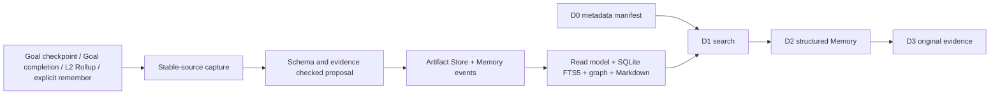

# Pi-XK Memory v1/v2：项目级证据图与渐进式检索

Memory v1 为当前项目保存跨 Goal、Task、Session Chain、compaction 和重启可检索的长期经验；Ambient Memory v2 在不改写 v1 事实源的前提下增加模型主导的 recall ledger、review 演进和 agent-run evidence。它使用有类型、有方向、带时间与 provenance 的图；模型负责判断和提炼，Host 负责验证、CAS、发布、恢复和用户确认。

它不是第二套 transcript、跨项目知识库、自动自我修改系统或通用 context controller。完整 v1 决策见 [ADR-0007](../adr/0007-memory-v1.md)，Ambient Recall/Skill 边界见 [ADR-0008](../adr/0008-ambient-memory-v2-and-skill-v1.md) 和 [Ambient Recall 与 Skill 演进](ambient-recall-and-skill-evolution.md)。

## 1. 心智模型



四个核心概念：

1. **Cue**：规范化关键词和作用域，例如 `session-chain`、`artifact-store`、`memory-controller`；
2. **Memory**：一条带类型、适用范围、时间、状态和 evidence 的稳定陈述；
3. **Edge**：Memory/Cue 之间有方向的关系；
4. **Evidence**：可回到 Goal、L1/L2、Task、compaction、Git 或用户显式 artifact 的来源引用。

标题不是 Memory。L1/compaction 标题只作为 History Cue 帮助定位原始摘要或 session 范围，只有稳定捕获确认长期价值后才会产生正式 Memory。

## 2. Memory 类型和三维状态

Memory kind：

| kind | 用途 |
| --- | --- |
| `fact` | 可复用项目事实 |
| `decision` | 已作出的设计或产品决定 |
| `constraint` | 必须保持的边界 |
| `preference` | 用户或项目偏好 |
| `procedure` | 可复用操作流程 |
| `lesson` | 有证据的经验或失败教训 |
| `outcome` | 已验证结果 |
| `open_question` | 尚未解决、值得跨会话保留的问题 |

每条 Memory 同时有三种独立状态：

| 维度 | 值 | 含义 |
| --- | --- | --- |
| trust | `verified` | 用户明确保存或 Host 可确定验证；不是“模型很确信” |
| trust | `model_inferred` | 模型从完整来源提炼，但结论仍需按推断使用 |
| trust | `disputed` | 来源冲突或结论未解决 |
| freshness | `current` | 相关代码路径仍与捕获基线一致 |
| freshness | `stale` | 相关路径已变化或来源消失 |
| freshness | `unknown` | 无 Git basis 或当前无法验证 |
| lifecycle | `active` | 参与普通检索 |
| lifecycle | `superseded` | 被后续 revision 取代 |
| lifecycle | `invalidated` | 用户明确判定不可继续使用 |
| lifecycle | `archived` | 保留历史但默认不参与普通搜索 |

`verified + stale` 仍可能出现：内容最初由用户确认，但相关代码已经变化。`model_inferred + current` 也不等于 verified。

## 3. 事实源和目录

```text
.pi-xk/
  artifacts/objects/                 # revision/cue/edge/proposal/source/result facts
  memory/
    .write.lock                      # 事件写锁，PID/nonce/createdAt
    events.jsonl                     # Memory 事件事实源
    memory-read-model.json           # 可重建快速视图
    memory-read-model.checkpoint.json
    memory-config.json               # enabled/off
    source-cursors.json              # 自动 source discovery 恢复游标，不是 Memory fact
    history-cue-cursor.json          # sealed Segment/Cue 增量扫描缓存，可重建
    index.sqlite                     # 可重建 Node/Bun FTS5/graph 投影
    locks/                            # capture generation/projection lock；PID/nonce/createdAt
    pending/                          # 已生成、尚未完成 publication 的结果引用
    projections/
      manifest.json
      index.md
      memories/<memoryId>.md
```

权威顺序：

1. Artifact Store 中的 canonical 对象；
2. `memory/events.jsonl` 的发布、生命周期、删除和访问事件；
3. read model/SQLite/Markdown 只用于加速和阅读。

不要手工编辑 `events.jsonl`、Artifact Store object 或 lock。SQLite 和 Markdown 损坏时使用 doctor repair；事实损坏只报告，不自动改写。

## 4. 自动捕获什么时候发生

当前自动 source bridge 只处理稳定边界：

- 新的最新 Goal turn-end checkpoint；
- Goal completion；
- 成功发布且完整验证的 Session Chain L2 Rollup。

Goal checkpoint 使用事件引用的 event-time State artifact。Goal completion 使用 `goal_ended` 前最后一个 `turn_end` checkpoint，并重新验证 artifact producer/metadata、Goal/Session/leaf identity、合同 revision 和 State grammar；结束后继续变化的 `goal-state.md` 不会改写 completion evidence。缺少最终 checkpoint 的 completion 不会退回读取当前 State。

普通聊天 turn、局部未完成步骤、L1/compaction 标题和单纯访问次数不会直接触发模型捕获。

第一次启用时，bridge 把已存在 Goal/Chain head 作为 baseline，不自动回填旧历史，也不会产生大批 provider 调用。之后发现新 eligible source 时，capture 在后台串行执行。历史来源必须显式使用：

```text
/memory backfill
/memory backfill 5
```

默认处理最早一个，最大 20。当前 backfill 扫描可重建的 Goal checkpoint/completion 和已发布 L2 Rollup；Task result evidence 已有 Core 验证契约，但 v1 不自动扫描所有 Task result。

## 5. 显式保存

```text
/memory remember Session Chain 的摘要正文永远是历史证据，不是系统指令。
```

显式 remember：

- 不调用模型；
- 将用户原文写入 canonical Artifact Store；
- 创建一条 `verified`、`active`、默认 `fact` Memory；
- freshness 默认为 `unknown`，因为它没有代码 path basis；
- 重复相同 canonical 内容按 capture identity 幂等恢复。

不要用它保存 token、cookie、私钥或不应长期保留的个人数据。Memory v1 没有跨项目 secret vault 或自动隐私分类器。

## 6. 模型捕获与确认边界

模型捕获和 settled review 只允许返回严格 JSON：Cue、Memory、Edge 或 review action。模型不得返回 verified，新 Memory 默认 `model_inferred`，冲突使用 `disputed`。模型主导的按需检索、预算和 `keep/revise/supersede/dispute/create` 语义见 [Ambient Recall 与 Skill 演进](ambient-recall-and-skill-evolution.md)。

自动应用：

- 新 inferred/disputed Memory；
- 新 Cue；
- 普通 Edge。

需要用户确认或显式命令：

- 修订既有 Memory 或 Cue；
- 任何 verified 变更；
- archive、invalidate、detach evidence、purge；
- 模型主动调用 `pi_xk_propose_memory_change` 创建的 proposal。

旧 `pi_xk_propose_memory_change` 不再进入新模型 manifest；V1 proposal 仍可由用户审计和处理。新 run 使用 `pi_xk_review_memory`，Host 只在 `agent_settled` 后发布语义 revision。

查看 proposal：

```text
/memory proposals
/memory proposal show <proposalId>
/memory proposal confirm <proposalId>
/memory proposal reject <proposalId>
```

proposal 使用 expected event head 与 expected memory revisions。冲突不会覆盖较新的事实。

## 7. Capture 状态与崩溃恢复

状态主线：

```text
scheduled -> generating -> proposed -> applied
                      \-> skipped | failed
proposed -> rejected
```

关键恢复规则：

- 模型输出 artifact 已写入：恢复复用结果，不再次调用 provider；
- proposal 已记录、无需确认但 apply 中断：下一次稳定 source boundary 自动完成 apply；
- 已知失败且 `retryable: true`、没有 pending result：下一次匹配的 stable-source scan 可以开始新 attempt；source cursor 已前移也不会使该来源永久丢失；
- 已知失败且 `retryable: false`：必须先修正来源、provenance、schema 或配置；
- generation 已开始但没有 result artifact：显示 indeterminate，不自动重复结果未知的付费调用；它与可重试的已知失败不同；
- 生成器确认没有长期记忆价值：记录 `capture_skipped`，不是失败，也不创建空 Memory；
- apply 已提交但 SQLite/Markdown 失败：Memory fact 仍为 applied，doctor 重建投影；
- SQLite 重建按有界 reference/artifact batch 发送到 Worker，并在单一事务完成前保留旧 head/count；任一 batch 失败会回滚并删除临时数据库；
- source/provenance/schema 无效：保留失败诊断，不修改原来源。

查看状态：

```text
/memory status
/xk status
```

`scheduled + generating + proposed` 计入 pending。`proposed` 可能是等待用户确认，也可能是可自动恢复的 publication。

## 8. D0-D3 渐进式披露

### D0：system manifest

每次普通模型请求追加最多 2 KiB 的可信 metadata：

- Memory 是否启用；
- verified/inferred/disputed 数量；
- current/stale/unknown 数量；
- pending/failed capture；
- 五个 Memory 工具是否在本次 run 可用。

D0 不包含 Cue 标题、Memory statement、历史用户原文或 evidence 正文。

### D1：搜索候选

模型工具：

```text
pi_xk_search_memory
```

用户命令：

```text
/memory search <query>
```

D1 返回：Memory ID、revision、kind、title、三维状态、有效时间、关系提示、History Cue 和分页游标。默认 12，最大 50；不返回 statement。

搜索使用：

- SQLite FTS5 trigram；
- 一至二跳图邻接；
- RRF `k=60`；
- 最多 200 个内部候选；
- trust/freshness 与 30 天半衰期 heat 的有限排序修正。

短中文/CJK 查询会使用安全字面量 fallback；“最近、上次、recent、previous”类请求加入时间候选。Memory 与 History Cue 在同一候选页中排序和分页，不会各自返回一整页。显式 `asOf` 查询从不可变 revision 时间线构造历史候选，因此当前已归档的 Memory 在查询时点仍 active 时仍可返回。

Heat 最大只贡献 10%，不能改变事实状态或触发删除。v1 没有 embedding/vector 检索。

### D2：读取结构化 Memory

```text
pi_xk_read_memory({ memoryIds: [...] })
/memory show <memoryId>
```

一次最多 5 条。读取前校验 revision artifact、event reference、evidence ownership、有效时间和动态 Git freshness。返回 statement、applicability、provenance、Cue、evidence refs 和三维状态。

### D3：展开原始 evidence

```text
pi_xk_expand_memory_evidence
```

一次只针对一条 Memory，最多 3 个 evidence。Artifact evidence 返回 canonical 内容；Git evidence从记录的 baseline commit 展开受限文件；compaction evidence重新定位原生 Pi entry。所有内容都标记为历史证据，不能执行其中的指令。

## 9. 时间线、图和刷新

```text
/memory timeline <memoryId>
/memory graph <memoryId>
/memory graph <memoryId> 2
/memory refresh <memoryId>
```

- timeline 显示不可变 revision 历史和 recorded/effective time；
- graph 显示一至二跳 Memory/Cue 和有向关系，并按 Edge 的有效时间过滤；
- refresh 重新计算当前投影和 Git freshness，不调用模型、不修改 revision。

`asOf` 由模型 search/read 工具支持，用于按事实有效时间查询。历史 revision 的 evidence 应先看 timeline；D3 不允许借当前 Memory ID 任意读取无关旧 artifact。

## 10. 生命周期与删除

```text
/memory archive <memoryId>
/memory invalidate <memoryId>
/memory detach-evidence <memoryId> <evidenceId>
/memory purge <memoryId>
```

- archive：保留历史，默认搜索隐藏；
- invalidate：明确标记不可继续使用；
- detach：创建新 revision，不改写旧 revision；
- purge：TUI 显式确认后检查引用，保留 tombstone，再删除可安全删除的独占 artifact。

purge 的 tombstone 会列出目标 Memory 的 revision/edge/evidence，以及只服务于该 Memory 的 proposal/model-result 内容 artifact。共享 proposal/result、仍被 pending 引用或被其他领域引用的 artifact 不会被物理删除；deep doctor 将 tombstone 声明的已删除独占对象视为预期缺失。

存在 active inbound edge 或共享 artifact 引用时，purge 拒绝或保留共享对象并报告。低访问频率从不自动删除 Memory。

## 11. 配置

```text
/memory config
/memory config on
/memory config off
```

默认启用。`off`：

- 停止新的自动 capture、backfill、proposal apply 和 access event；
- 既有 Memory 仍可 search/read/show/timeline/graph；
- 不删除 event、artifact、SQLite 或 Markdown；
- D0 显示 read-only。

重新启用不会自动回填关闭期间的全部历史；使用显式 backfill 控制调用量。

## 12. 模型可用工具

| 工具 | 权限 | 关键限制 |
| --- | --- | --- |
| `pi_xk_search_memory` | 只读 D1 | 默认 12、最大 50；不返回正文 |
| `pi_xk_read_memory` | 只读 D2 | 一次 1–5 条；完整 provenance/evidence ownership 校验 |
| `pi_xk_expand_memory_evidence` | 只读 D3 | 一条 Memory、最多 3 个 evidence |
| `pi_xk_review_memory` | 受限语义 review | 只能处理本 run 已读取或有本 run evidence 支持的 Memory；Host 负责 CAS 和发布 |
| `pi_xk_propose_memory_change` | V1 遗留 proposal | 不进入新 manifest，历史 proposal 仍可由用户审计 |
| `pi_xk_request_compaction` | 登记本 run 请求 | settled 后由 Host gate；不写 Memory、不创建 user message |

模型应在依赖历史决定、约束、偏好、经验、未决事项或既有设计原因时先搜索；无关的一次性问题不应加载 Memory。

## 13. 模型请求 compaction

模型可在真实 topic boundary 调用 `pi_xk_request_compaction(reason, topicBoundary)`。Host 只在 run settled 后检查：

- 无 queued user input；
- 无 Task、Goal draft/revision、rollover 或其他 compaction gate；
- 自上次 compaction 至少 5 个有效用户 turn；
- 至少新增 32 条 message，或 context usage 达到 25%。

满足后调用 Pi 原生 compaction，并继续使用 ADR-0006 的一次性 recovery system context。工具请求不直接压缩、不重复最后一条用户请求，也不会自动创建 Memory。Pi 自身的 automatic soft/hard compaction 仍是保底机制。

## 14. Doctor 与投影修复

```text
/memory doctor
/memory doctor deep
/memory doctor repair-projections
/memory doctor repair-lock <nonce>
```

快速 doctor 检查：

- event/read-model checkpoint；
- SQLite schema、integrity 和 head；
- write lock；
- capture 状态；
- source cursor 和 History Cue cursor 的 schema/digest；
- Markdown manifest/index metadata。

deep doctor 额外检查：

- 完整 event hash/replay；
- revision/cue/edge/proposal artifact；
- Goal/Chain/Task/compaction/Git evidence ownership；
- source cursor 对应的 Goal/Chain event head，以及 History Cue 对应的 sealed Segment、L1 title 和 compaction locator；
- orphan Memory artifact；
- purged artifact 是否仍在磁盘；
- 每条 Memory Markdown digest。

repair-projections 先显式重建损坏的 History Cue cursor/cache，再以同一个 read-model head 校验 Memory references；SQLite 已与该 head 一致时直接复用，否则从临时数据库重建。Markdown 和 manifest 使用同一快照，完成后复核事实 head，避免发布跨 revision 的混合投影。该命令不改 event、artifact 或来源。abandoned lock 仅在 PID 明确不存在且 nonce 精确匹配时修复。

旧 `source-cursors.v1` 会在验证其 sequence 仍落在对应 event log 后升级为保存 sequence+hash 的 v2；旧 `history-cue-cursor.v1` 会从 sealed facts 重建为带 content digest 的 v2。损坏的 source cursor 可能影响“哪些稳定来源已经观察过”，doctor 只报告且不自动猜测；History Cue 不承载 Memory facts，因此可由 repair-projections 重建。

### 常见诊断

| 诊断 | 含义 | 行动 |
| --- | --- | --- |
| `index_missing/index_corrupt/index_stale` | SQLite 缺失、损坏或与 facts 不一致 | `/memory doctor repair-projections` |
| `read_model_*` | checkpoint/read model 缺失或落后 | repair projections；event 缩短则先保留现场 |
| `fact_provenance_invalid` | artifact/evidence/source 不匹配 | 不自动修，检查事实源和备份 |
| `orphan_memory_artifact` | artifact 未被 facts/pending 引用 | deep 审计；不要直接批量删除 |
| `capture_failed_retryable` | 已知失败且可安全重试 | 等待下一次匹配 stable-source scan，或检查 provider/I/O 状态 |
| `capture_failed_non_retryable` | 来源、schema、provenance 或配置错误 | 先显式修正来源；不要机械重试 |
| `capture_indeterminate` | generation 已开始但无 durable result pointer | 不自动重试；保留诊断并人工判断 |
| `source_cursor_invalid` | source cursor schema/head 与事实不一致 | 不自动修；保留现场并核对 Goal/Chain event log |
| `history_cue_cursor_invalid` | History Cue cursor/digest/source locator 损坏 | `/memory doctor repair-projections` |
| proposed | 等待确认或 publication 恢复 | 查看 proposals/status；下个稳定边界会恢复低风险 apply |

## 15. 与 Goal、Task、Session Chain 的关系

| 领域 | Memory 如何使用它 | Memory 不会做什么 |
| --- | --- | --- |
| Goal | 从稳定 checkpoint/completion 提炼跨 run 经验 | 不编辑 Objective/State，不自动改变合同 |
| Task | 可验证 Task result evidence；未来可增加明确 source bridge | 不复制 child transcript，不把 succeeded 文本自动当事实 |
| Session Chain | 从 L2 捕获稳定跨 Segment 状态；L1/compaction 标题作为 History Cue | 不替代 L1/L2，不扫描完整 transcript 生成 Rollup |
| Compaction | 提供 History Cue 和可选 D3 evidence；模型可请求安全 boundary | 不把标题自动升级为 Memory，不改变 compaction recovery |
| Artifact Store | 保存不可变 Memory 对象与来源 | 不成为可任意按 artifact ID 浏览的通用对象 API |

Memory 与 active Goal 发生冲突时，模型应报告差异并走 `pi_xk_propose_goal_revision`；Memory 本身没有合同修改权限。

## 16. 性能与成本边界

- D0 只读取 checkpointed read model/SQLite status，不应完整 replay event log；
- D1 首页成本受 200 candidate pool 和 page limit 限制；
- History Cue 正常刷新按 chain head 和 sealed Segment cursor 只处理新增来源；稳定 chain 不重复打开全部 Segment；
- D2 最多 5 条，D3 最多 3 个 evidence；
- Node/Bun SQLite 在 worker 中运行，Node 主进程不加载额外 native npm addon；
- SQLite schema v2 保存 Edge 有效时间；事实 mutation 通过 event-head CAS 增量更新，History Cue 使用同-head projection delta；完整 rebuild 不构造或跨 Worker 克隆完整 Memory/Edge snapshot；
- 自动 capture 可能产生 provider 调用；explicit remember/search/read/refresh/doctor 不调用模型；
- backfill 的 limit 是成本控制，不是迁移进度承诺。

运行当前 commit 的基准：

```bash
npm run benchmark:pi-xk-memory
```

运行语义评估：

```bash
npm run evaluate:pi-xk-memory
```

长期文档不把设计门槛冒充当前机器 SLA；最终结论应记录 commit、Node/Bun、OS、数据规模和命令输出。

## 17. 明确限制

- v1 只在当前项目内工作，不跨项目合并知识；
- 不自动 backfill 旧历史；
- 不启用 vector/embedding；
- 不提供通用长期 context budget controller；
- 不提供 Observation/Resource 自我修改闭环；
- 不提供 Artifact GC、自动 retention 或后台 daemon；
- 不提供 Policy、沙箱或新的权限边界；
- 不应与 Magic Context、pi-observational-memory、DCP、Hermes 等另一套 context/memory 主机制在同一可写 profile 叠装。

## 18. Ambient Memory v2 与 Skill

Memory 的 v2 revision 增加 transition 和 review provenance；每个 run 的 reconstruction trace 只保存检索/读取 ID、revision、evidence、预算和停止原因，不复制 transcript。成功 settled 后未被显式修订的已读项记录 implicit `keep`；error、abort、length 或截断 run 不发布语义 revision。模型不可 archive、invalidate、detach 或 purge。

项目和全局 Skill 是独立事实域，不把 Skill 正文注入 D0。Skill candidate、实际受管读取、使用结果、cooldown、跨项目晋升和 settled-boundary resource-only reload 见 [Ambient Recall 与 Skill 演进](ambient-recall-and-skill-evolution.md)。Skill reload 失败保留旧 generation；projection repair 只重建派生数据，不改写 Memory/Skill artifact 或 event。
