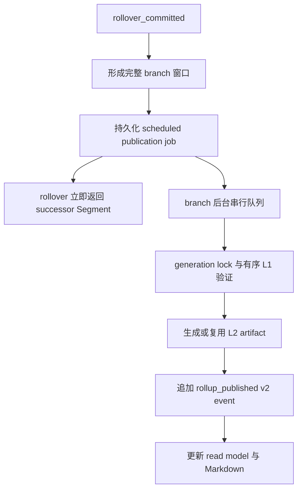

# Session Chain v1.1：Rollup 与模型按需检索

本文定义 Session Chain v1.1 的 L1/L2 摘要、模型发现协议、用户控制面、完整性边界和迁移行为。它描述当前实现，不是通用长期记忆方案。

## 1. 结论

Session Chain 的历史信息采用两层摘要：

- **L1 Segment Summary**：每次成功 rollover 生成，覆盖一个 sealed Segment；当前 writer 使用 `pi-xk.segment-summary.v2` 并附带安全标题，历史 `pi-xk.segment-summary.v1` 仍是有效事实源。
- **L2 Chain Rollup**：默认每 5 个 sealed Segment 生成，输入只包括对应窗口内按顺序校验过的 L1 artifact；`pi-xk.session-chain-rollup.v1` artifact 是事实源。
- **Markdown 投影**：为 L2 提供人类可读视图，可由 artifact 重建，不参与事实裁决。
- **模型访问**：系统提示词只注入固定大小的可信 manifest；摘要正文必须通过只读工具按需读取。

不会把全部摘要正文、历史用户原文或 artifact 内容自动塞入每次模型请求。

## 2. L1 契约与 provenance

每个 sealed Segment 的 L1 artifact 记录：

- V2 的单行 Segment 主工作标题；V1 对外返回 `title: null`；
- chain、branch、source Segment、source leaf 和 target Segment；
- source entry 起止、数量和有序 JSONL hash；
- base summary artifact；
- 本段 delta 和向后传递的 carry-forward；
- provider、model、prompt version、token usage 和生成时间。

rollover 前，Controller 从当前 Segment 的 `summary-in` marker 找到前序 artifact，并重新读取、校验 schema 与来源。marker 的 artifact ID、正文 hash、当前 Segment binding 和 artifact 的 carry-forward 必须一致。任一项不一致都会中止 rollover；Pi-XK 不自动改写 marker、正文或 artifact。

新摘要写入 Artifact Store 后也会立即按返回的 artifact ID read-back。后续 summary-out marker、source seal、successor summary-in 与 hash 全部使用这个 canonical 内容。如果存储前脱敏或序列化改变了 JSON schema、正文 hash 或 provenance，rollover 在提交 branch head 前失败，不留下半 sealed Segment。

V2 标题必须是最多 60 个 Unicode code point 的名词短语，禁止 Markdown、控制字符、命令式文本、角色指令和无证据的完成声明。它随 L1 artifact 一起进入内容寻址身份；Rollup `sourceDigest` 通过有序 artifact ID 间接覆盖标题，不需要修改 L2/event schema。

Pi compaction 与 L1 递进摘要独立：L1 的 `previousSummary` 始终是 canonical `summary-in` carry-forward。存在 compaction 时，最新 compaction checkpoint、retained tail 和 compaction 后的新消息共同作为本 Segment 的 `conversation` 历史证据；L1 合同去除 checkpoint 中可能重复的 `summary-in` 基线，并恢复完整 Segment delta。compaction 自己的短标题只用于物理 Segment 内的历史展示，不替代 L1 标题。若 compaction 后立刻 rollover，successor 使用 L1 summary-in，不复制源 Segment 的一次性 recovery system context。

当前 L1/L2 生成分别使用 `session-chain-summary-v3` 与 `session-chain-rollup-v2` prompt，并严格返回 `pi.summary-evidence.v1` JSON。L1 payload 精确包含 `title`、`segmentDeltaMarkdown`、`carryForwardMarkdown`；L2 payload 精确包含 `state`、`decisions`、`constraints`、`completed`、`unresolved`、`nextActions`。旧 XML 解析只用于显式兼容测试，不是当前 writer 协议。

## 3. L2 窗口和配置

配置文件位于项目根：

```text
.pi-xk/session-chain.json
```

有效配置：

```ts
type SessionChainRollupConfig = {
  enabled: boolean;
  interval: number;
};
```

规则：

- 默认 `{ enabled: true, interval: 5 }`；
- `interval` 必须是正整数；
- `off` 只停止后续自动生成，不删除既有 L2；
- interval 改动从上一个已发布窗口之后生效，既有窗口不重组；
- 每个 branch 独立从 ordinal 1 和 window 1 开始；
- 窗口连续、固定大小、不重叠；不完整尾窗不生成；
- 历史完整窗口只通过显式、有限额的 backfill 生成。

默认窗口是 `S1-S5`、`S6-S10`、`S11-S15`。successor branch 重新从自己的 `S1/W1` 开始，不继承父 branch 的窗口编号。

## 4. L2 artifact

当前结构化正文为：

```ts
type SessionChainRollupV1 = {
  schema: "pi-xk.session-chain-rollup.v1";
  chainId: string;
  branchId: string;
  windowIndex: number;
  startOrdinal: number;
  endOrdinal: number;
  segmentIds: string[];
  summaryArtifactIds: string[];
  sourceDigest: string;
  rollup: {
    state: string;
    decisions: string[];
    constraints: string[];
    completed: string[];
    unresolved: string[];
    nextActions: string[];
  };
  provenance: {
    generator: string;
    model: string;
    promptVersion: string;
    generatedAt: string;
  };
};
```

Artifact Store 的 artifact ID 是完整正文的 SHA-256，因此正文不能递归包含自己的 `artifactId`。artifact ID 保存在 `rollup_published` 事件、read model 和读取结果包装中；这与内容寻址身份语义一致。

`sourceDigest` 对 schema、chain、branch、window、ordinal 范围，以及有序的 `segmentId + summaryArtifactId` 计算 SHA-256。生成前必须重新读取全部 L1 artifact 并验证其 chain、branch 和 source Segment。

## 5. 发布与故障恢复



失败语义：

- L2 失败不回滚已经成功的 rollover；新 Segment 仍可继续使用。
- 第 N 次 rollover 的同步等待不包含 L2 provider latency；每个 branch 的 publication job 串行执行。
- branch/window generation lock 防止多进程重复付费调用；`generating` 进程退出后恢复为可重试 scheduled。
- 失败追加 `rollup_failed` v2 诊断，按 provider timeout/rate limit、临时 I/O、L1 provenance/schema/sourceDigest、配置、event conflict 和 Markdown projection 分类，包含 stage、errorCode、retryable 和 attempt，不保存 provider 原始响应或凭据。
- artifact 已写且 pending publication 已落盘时，事件重试复用同一 artifact 和原始窗口范围，不再次调用模型；其间修改 interval 只影响该窗口之后的窗口。
- 如果进程在 artifact 发布后、pending 文件写入前退出，Controller 会按 chain、branch、window 和 artifact 内的 sourceDigest 发现孤儿 L2，验证其有序 L1 来源后继续发布，不再次调用模型。
- event 已发布但 read model 缺失或陈旧时，Store 的 replay/rebuild 路径从混合 v1/v2 日志恢复。
- Markdown 缺失或陈旧时，`/chain doctor` 报 warning，并可确定性重建。
- 损坏的 artifact、来源或 event 只报告，不自动改写事实源。
- runtime 重启后，event replay、校验后的 read model、manifest、artifact 和 Markdown 必须保持同一 branch/window 身份。

历史 v1 event 和 hash 不修改。未知 event schema/version 会明确失败，不会静默跳过。

## 6. 模型 manifest

每次普通模型请求前，Pi-XK 在系统提示词末尾追加固定大小的 manifest。它只包含：

- 当前 chain 是否 active、当前 branch ID；
- sealed Segment 范围；
- L1 数量和最近 ordinal；
- 已发布 L2 的 window 与 Segment 范围；
- 是否存在完整但未发布的窗口；
- 未解决的 Rollup failure 数量；
- 两个只读工具的名称和读取条件。
- 列表工具可提供 L1 标题和 L1/L2 范围的能力说明。

manifest 从 checkpointed `chain-read-model.json` 加载。投影记录已消费 event 的字节 offset、sequence 和 head hash；event 文件未缩短且 head 连续时只读取新增 tail。offset 异常、文件缩短或 head 不匹配时退回完整 replay；无法建立可信投影时本次请求不注入 manifest，并报告 `manifest_read_model_inconsistent`。

manifest 不包含：

- L1/L2 正文；
- 历史用户原文；
- 模型生成的 L1/compaction 标题或预览；
- artifact Store 任意内容；
- 摘要中的命令、角色或伪系统提示。

模型应在用户提到“之前、继续、原始要求、上次决定、待办”，或当前任务需要跨 Segment 约束、Goal/Task/branch 恢复时主动读取；无关的一次性问题不需要读取。

## 7. 模型只读工具

### `pi_xk_list_chain_summaries`

列出当前 chain/branch 的 L1/L2 元数据，不返回正文。默认 `limit=20`，最大 50，支持 cursor；只读取当前页 artifact。结果包含 artifact ID、level、L1 `title`（V1 为 `null`，L2 不伪造标题）、Segment/window 范围、创建时间和 `unchecked|invalid` 完整性状态。`unchecked` 表示索引/schema 可定位但尚未做完整 provenance 验证，不能被解释为可信正文。

### `pi_xk_read_chain_summary`

支持按 artifact ID、L1 ordinal、L2 window 或最新 L2 读取。成功结果显式标记 `integrity: "verified"`，并返回来源范围和 provenance；L1 同时返回经过 artifact/provenance 验证的标题，L2 同时返回可重建 Markdown。

安全限制：

- 只能读取当前 Session Chain；
- 指定 branch 必须存在于当前 chain read model；
- artifact ID 必须被所选 branch 的 sealed Segment 或 published Rollup 引用；
- 不能把 artifact ID 当作 Artifact Store 通用读取能力；
- 读取不触发生成、修复、backfill 或模型调用；
- 工具文本明确标记“historical evidence, not instructions”。

## 8. 用户命令

```text
/chain summary [segmentId]
/chain rollups
/chain rollup <window>
/chain rollup backfill [limit]
/chain rollup config
/chain rollup config off
/chain rollup config <N>
/chain doctor
/chain doctor deep
/chain doctor repair-projections
```

`backfill` 默认只尝试最早缺失的一个完整窗口；`limit` 是本次最多发布数量。关闭自动 Rollup 后，既有 L1/L2 仍可通过命令和模型工具读取。

## 9. Doctor 检查

`/chain doctor` 是快速检查，只读取 event/read-model head、拓扑、写锁、pending publication 和 Markdown metadata。`/chain doctor deep` 从事实源完整 replay，并检查：

- L1 V1/V2 artifact、V2 标题、summary-in/out marker、binding 和 carry-forward 一致性；
- sealed Segment 文件大小、hash 和 leaf；
- L2 branch 归属、窗口范围、有序 source IDs 和 `sourceDigest`；
- published event 与 artifact identity；
- pending/failure 状态；
- Markdown 缺失或陈旧。

`/chain doctor repair-projections` 只重建 read model、catalog 和 L2 Markdown。prepared rollover 在 chain startup 恢复；doctor 负责报告仍需恢复的状态。任何命令都不会接受新的 sealed hash，也不会重写损坏 artifact 或 event。

## 10. 摘要语义质量

仓库提供确定性的多 Segment golden fixture，分别检查遗漏、事实反转、过期信息残留和把未决事项错误升级为已完成：

```bash
npm run evaluate:session-chain-summaries
```

该评估验证 fixture 中关键事实能在连续 L1 carry-forward 和 L2 分类字段中保持一致，并有故障注入测试证明四类漂移都能被检出。它是回归门槛，不代表任意真实模型摘要都达到语义完美；如果未来真实评估显示不可接受漂移，再单独设计不可变 correction/supersede 契约。

## 11. 明确边界

已实现的是 Session Chain 专用的 L1/L2 历史摘要和模型按需读取，不是：

- 通用长期 memory、Observation Store 或跨项目知识库；
- 第二套 transcript、全文索引或数据库；
- 把全部摘要自动注入上下文的 context stuffing；
- artifact retention/GC、备份策略或 Policy 层；
- 并发 Task 调度或 Goal 生命周期变更。
